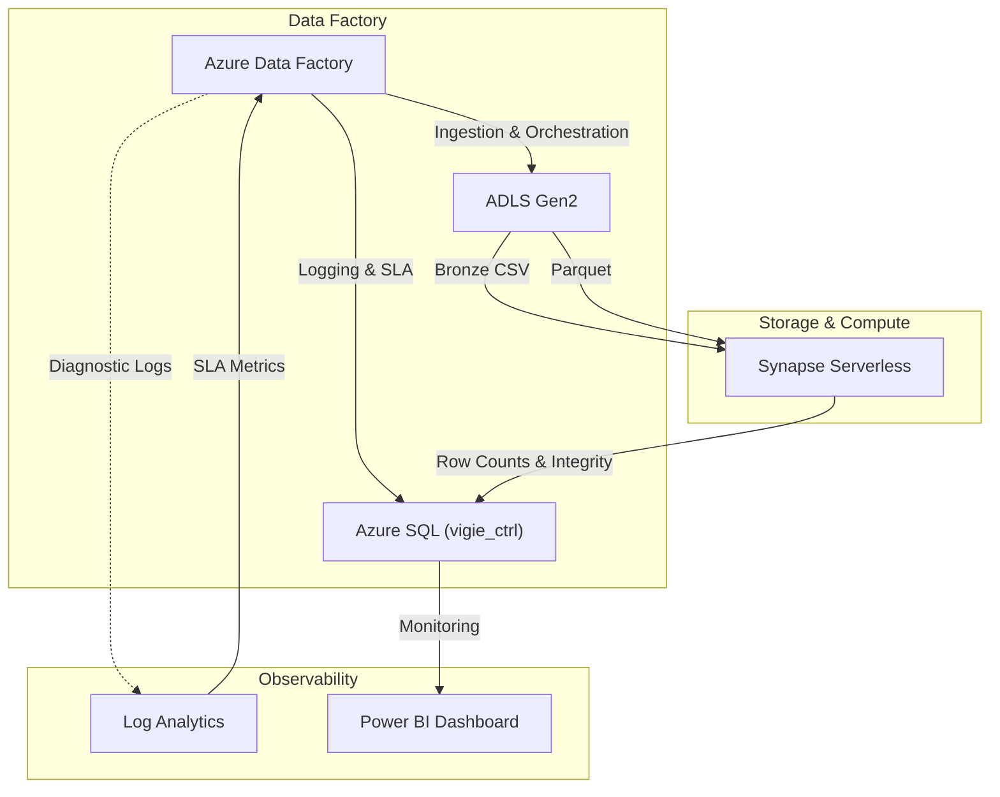

# 🏗️ Architecture

L'ŒIL est conçu comme un **framework de contrôle** qui orchestre la qualité des données à travers l'écosystème Azure Data sans être intrusif dans les transformations métier.

## High-Level Overview

## Composants Clés

| Composant | Rôle |
|---|---|
| **Azure Data Factory (ADF)** | Orchestrateur principal. Déclenche les ingesions, appelle les procédures stockées de contrôle, et gère le flux d'exécution. |
| **Azure SQL Database** | **Source de vérité**. Contient les contrôles (`vigie_ctrl`), les règles (`vigie_policy_*`), et l'historique d'exécution. C'est le cerveau du framework. |
| **Synapse Serverless** | Moteur de compute à la demande. Utilisé ponctuellement pour valider des règles complexes (checksums, distributions) sur les fichiers du Data Lake. |
| **Log Analytics (KQL)** | Audit trail et métriques fine-grained. ADF interroge KQL pour récupérer des durées précises et des volumes d'ingestion. |
| **ADLS Gen2** | Stockage des données (Bronze CSV, Silver Parquet) et des artefacts de contrôle (`.json`, `.done`). |

## Flux de Données (Control Flow)

1.  **Start Run** : ADF appelle `SP_Set_Start_TS_OEIL` pour initier un contrôle dans SQL.
2.  **Ingestion** : ADF copie les données.
3.  **Validation** :
    *   ADF récupère les métriques d'exécution via KQL.
    *   Si activé par la policy, Synapse scanne les fichiers pour valider l'intégrité (checksum, nulls).
4.  **End Run** : ADF appelle `SP_Set_End_TS_OEIL`.
    *   SQL calcule la durée totale.
    *   SQL évalue les SLA (Fast/Slow/Fail) en fonction des seuils définis.
    *   SQL lève des alertes si nécessaire.
5.  **Audit** : Un fichier JSON `CTRL` contenant tous les résultats est généré et stocké dans le Data Lake pour immuabilité.
