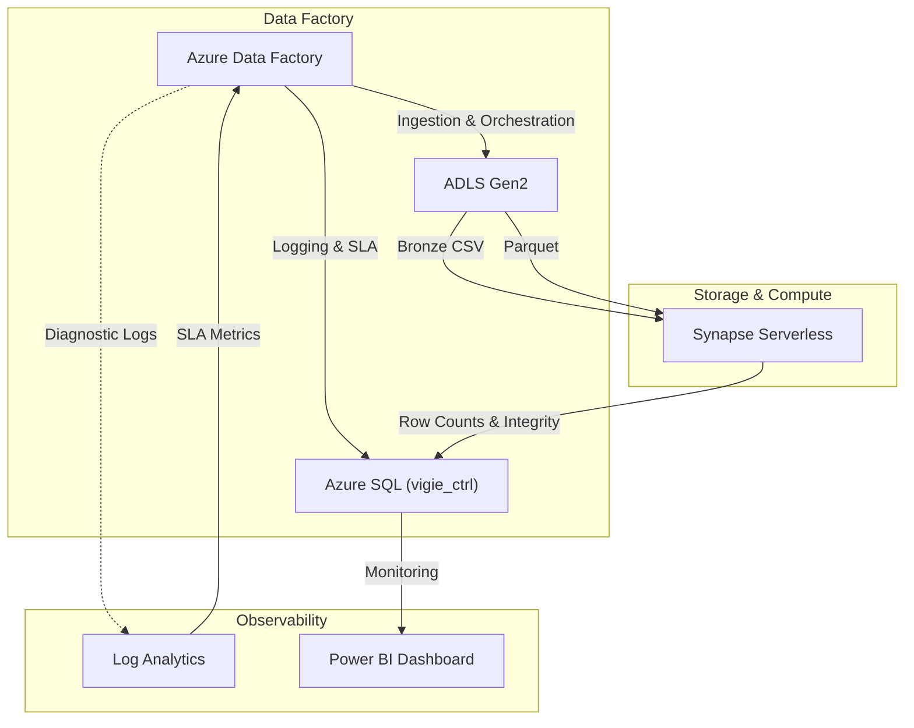

# 🏗️ Architecture

L'ŒIL est conçu comme un **framework de contrôle** qui orchestre la qualité des données à travers l'écosystème Azure Data sans être intrusif dans les transformations métier.

## Note d'architecture (mise à jour)

Depuis la version actuelle, l'orchestration est scindée en deux pipelines:

- `PL_Oeil_Guardian` prépare le run (lecture CTRL, upsert, métriques ADF), vérifie le hash canonique du CTRL et agit comme garde d'intégrité.
- `PL_Oeil_Core` exécute le cœur qualité/SLA/alertes après validation du hash.
- Les validations Synapse (`ROW_COUNT`, `MIN_MAX`) et la consolidation Synapse SLA/coût restent centralisées dans `PL_Oeil_Quality_Engine` (appelé depuis `PL_Oeil_Core`).

## 👁️ Modèle conceptuel

L’ŒIL repose sur deux axes complémentaires :

- Œil gauche (Contrat) : le fichier CTRL définit ce qui est attendu.
- Œil droit (Exécution) : ADF + Synapse produisent ce qui est réellement exécuté.

Le framework compare en permanence le contrat et la réalité.

Les règles appliquées sont déterminées dynamiquement à partir des tables `vigie_policy_*`.

## High-Level Overview

## Composants Clés

| Composant | Rôle |
|---|---|
| **Azure Data Factory (ADF)** | Orchestrateur principal. Déclenche les ingesions, appelle les procédures stockées de contrôle, et gère le flux d'exécution. |
| **Azure SQL Database** | **Source de vérité**. Contient les contrôles (`vigie_ctrl`), les règles (`vigie_policy_*`), et l'historique d'exécution. C'est le cerveau du framework. |
| **Synapse Serverless** | Moteur de compute à la demande. Utilisé ponctuellement pour valider des règles complexes (checksums, distributions) sur les fichiers du Data Lake. |
| **Log Analytics (KQL)** | Audit trail et métriques fine-grained. ADF interroge KQL via `WebActivity` pour récupérer des durées précises et des volumes d'ingestion. |
| **ADLS Gen2** | Stockage des données (Bronze CSV, Silver Parquet) et des artefacts de contrôle (`.json`, `.done`). |

## Flux de Données (Control Flow)

1.  **Start Run** : ADF appelle `SP_Set_Start_TS_OEIL` pour initier un contrôle dans SQL.
2.  **Ingestion** : ADF copie les données.
3.  **Validation** :
    *   ADF récupère les métriques d'exécution via KQL avec `WebActivity`.
    *   `PL_Oeil_Guardian` vérifie le hash canonique via `SP_Verify_Ctrl_Hash_V1` puis gate l'exécution.
    *   Si le hash est valide, `PL_Oeil_Guardian` appelle `PL_Oeil_Core`, qui appelle ensuite `PL_Oeil_Quality_Engine`.
    *   Dans `PL_Oeil_Quality_Engine`, Synapse scanne les fichiers pour valider `ROW_COUNT` et `MIN_MAX`, puis SQL met à jour SLA/coût Synapse.
4.  **End Run** : ADF appelle `SP_Set_End_TS_OEIL`.
    *   SQL calcule la durée totale.
    *   SQL évalue les SLA (Fast/Slow/Fail) en fonction des seuils définis.
    *   SQL lève des alertes si nécessaire.
5.  **Audit** : Un fichier JSON `CTRL` contenant tous les résultats est généré et stocké dans le Data Lake pour immuabilité.
