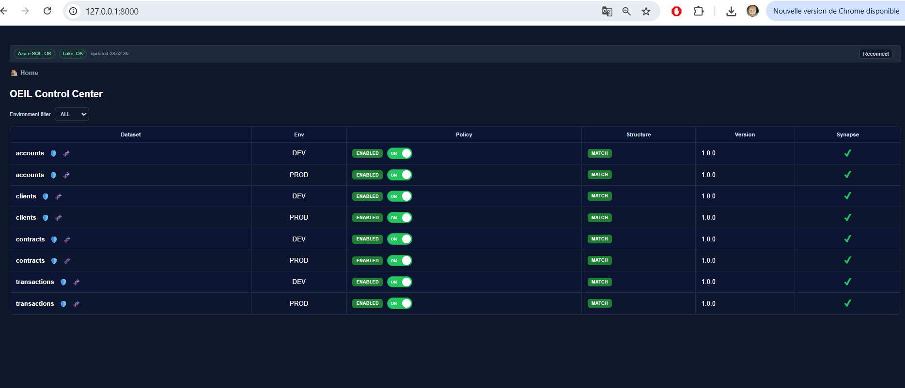
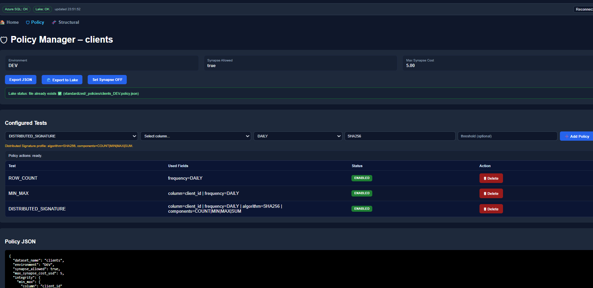
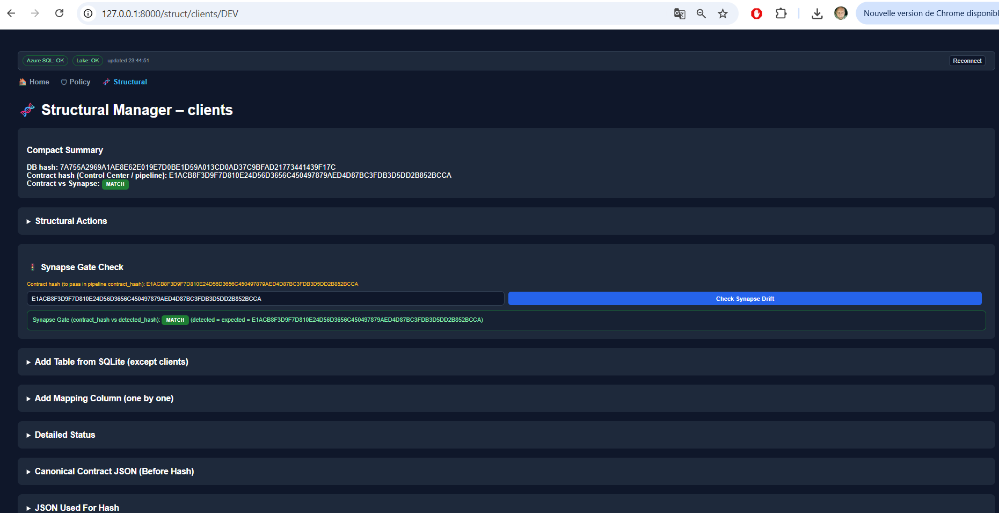

# 🏛️ Policy Engine (v2)

Le modèle de gouvernance de L'ŒIL est **SQL-first**. Les règles de qualité sont définies dans des tables de référence et exportées en JSON pour l'audit.

Les règles sont résolues dynamiquement à l'exécution par `PL_Oeil_Quality_Engine`.
Aucune règle n’est codée en dur dans les pipelines.

## Oeil Control Center (UI)

Le moteur de policy est désormais exploitable via le Control Center Python:

- Guide complet: [Oeil Control Center](../guides/control_center.md)
- UI FastAPI: `python/oeil_ui/main.py`
- Templates HTML: `python/oeil_ui/templates/`

### Aperçu UI

- Home



Légende rapide:
- Contrôler la santé Azure SQL et Lake.
- Filtrer DEV/PROD puis ouvrir Policy ou Structural.
- Vérifier l’état Policy/Structure/Synapse de chaque dataset.

- Policy



Légende rapide:
- Ajuster les tests actifs et leur fréquence.
- Vérifier les champs utilisés par test.
- Exporter la policy en JSON et vers le Lake.

- Structural



Légende rapide:
- Lire le résumé des hash DB et Contract.
- Comparer contract_hash et detected_hash.
- Confirmer MATCH ou investiguer DRIFT.

## Marquage audit

- **[Implemented]** : comportement déjà observé dans les pipelines/queries.
- **[Recommended]** : convention cible à appliquer de façon uniforme.

## Modèle de Données

```
vigie_policy_table          vigie_policy_test
┌──────────────────┐        ┌──────────────────────────┐
│ dataset (PK)     │───────▶│ dataset (FK)             │
│ environment      │        │ test_type                │
│ enabled          │        │ enabled                  │
│ synapse_allowed  │        │ frequency (DAILY/WEEKLY)  │
│ max_synapse_cost │        │ target_column            │
└──────────────────┘        │ algorithm                │
                             └──────────────────────────┘
```

1.  **vigie_policy_table** : Configuration par dataset.
    *   `dataset_name` : Nom unique du jeu de données.
    *   `environment` : Contexte d'exécution (DEV/PROD). Permet d'avoir des règles plus strictes en DEV.
    *   `synapse_allowed` : Flag global pour autoriser ou bloquer l'usage de Synapse (pour contrôler les coûts).
    *   `max_synapse_cost_usd` : Budget maximum alloué par run.

2.  **vigie_policy_test** : Liste des tests activés.
  *   `test_type_id` : Référence au type de test (Row Count, Min/Max, Distributed Signature, etc.).
  *   `frequency` : Périodicité d'exécution (ex: DDS quotidien en DEV, ciblé/optimisé en PROD).
    *   `threshold_value` : Seuil de tolérance (ex: 5% d'écart max).

## Export JSON

La policy complète est exportable en JSON pour être stockée dans le Data Lake. Cela permet de versionner la politique appliquée à un instant T.

**Exemple d'export :**

```json
{
  "dataset": "accounts",
  "environment": "PROD",
  "is_active": true,
  "synapse_allowed": true,
  "max_synapse_cost_usd": 5.00,
  "integrity_policy": {
    "row_count": {
      "enabled": true,
      "frequency": "DAILY",
      "threshold_delta_percent": 5
    },
    "min_max": {
      "enabled": true,
      "column": "account_id",
      "min": 100000,
      "max": 999999,
      "frequency": "DAILY"
    },
    "distributed_signature": {
      "enabled": true,
      "column": "account_id",
      "algorithm": "SHA256",
      "components": "COUNT|MIN|MAX|SUM|SUM_CHECKSUM|SUM_BINARY_CHECKSUM",
      "frequency": "WEEKLY"
    }
  }
}
```

## Applicabilité par périodicité & statut de test [Recommended]

### Règles d'applicabilité

Un test est considéré **applicable** pour un run si :

1. le dataset policy est actif (`is_active = 1`),
2. le test est activé (`is_enabled = 1`),
3. la fréquence du test est compatible avec la périodicité du run.

### Statut attendu si test non exécuté

- `SKIPPED` : test non applicable (fréquence/policy).
- `MISSING` : test applicable mais résultat absent (incident d'exécution).

### Normalisation `test_code`

Convention recommandée : `UPPER_SNAKE_CASE` (ex: `ROW_COUNT`, `MIN_MAX`, `NULL_COUNT`).

### Réduction en cas de tests multiples pour un même `ctrl_id` [Implemented]

- Source de vérité : dernier résultat valide par (`ctrl_id`, `test_code`, `column_name`).
- Tri technique recommandé : `ORDER BY integrity_result_id DESC`.
- La réduction ne doit jamais dépendre de l'ordre implicite d'insertion.
