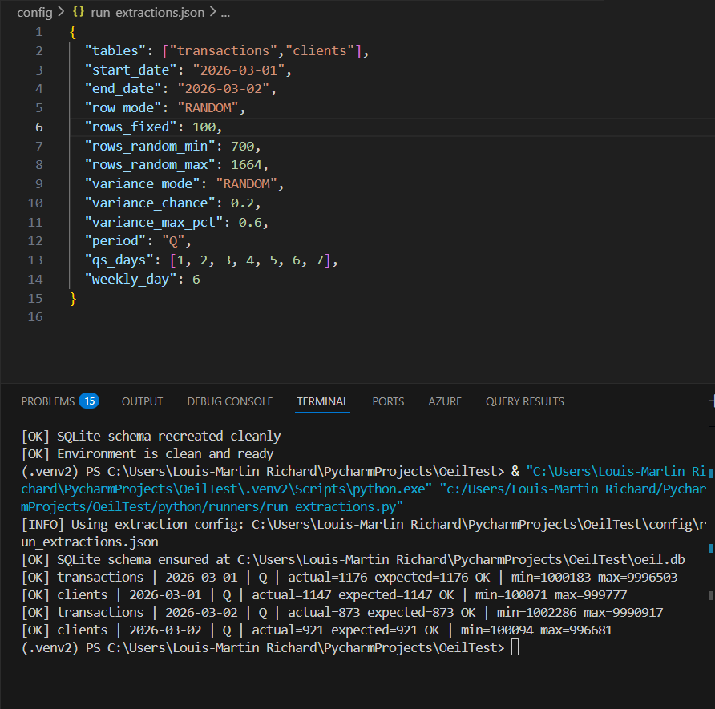
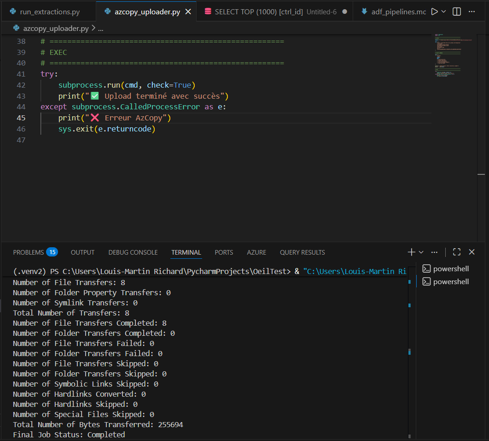
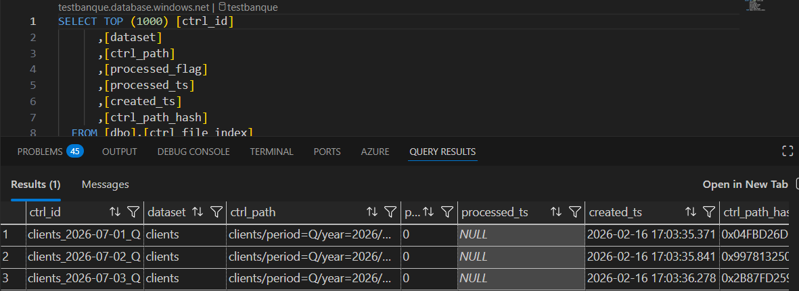
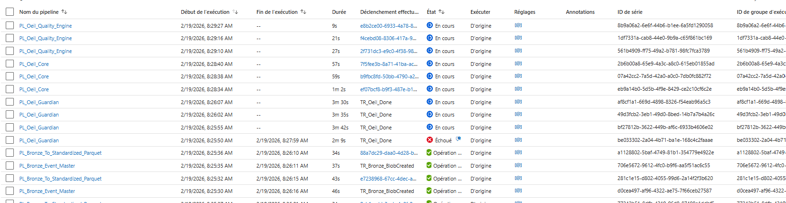
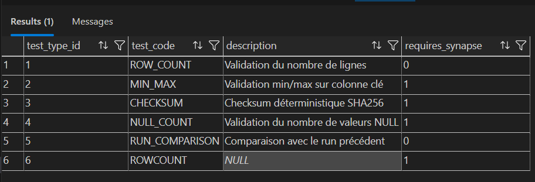
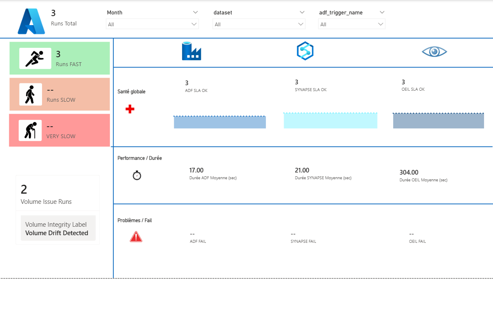
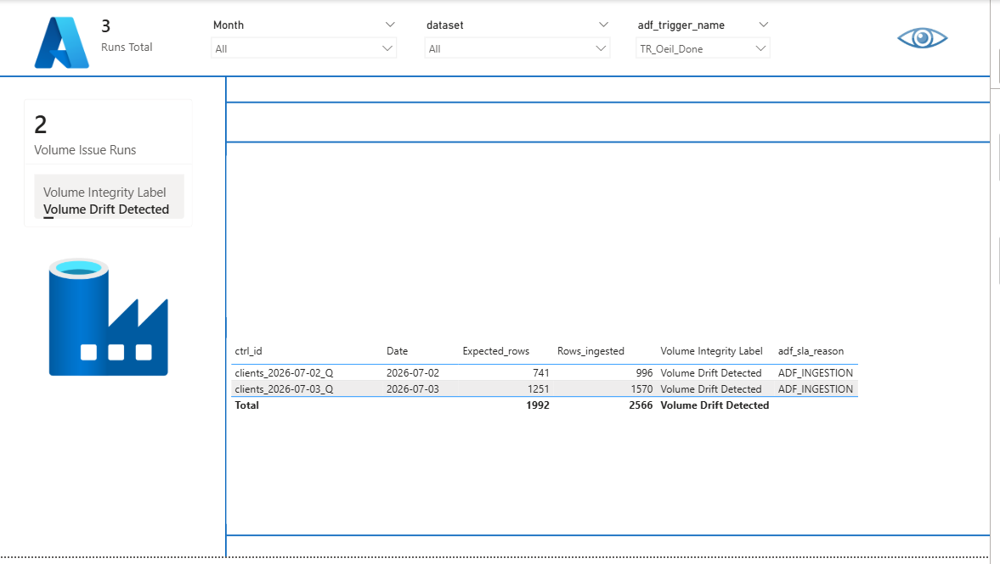

# 🎬 Demo Run — End-to-End

Documentation pas à pas d’un run de démonstration L’ŒIL, avec screenshots.

## Étape 1 — Run extraction simulé (source externe type DataStage via Control-M)

### Contexte

- Exécution de `python/runners/run_extractions.py` avec `config/run_extractions.json`.
- Simulation d'une extraction amont externe (ex: DataStage orchestré par Control-M).
- Datasets: `transactions` et `clients`.
- Fenêtre de démonstration: du `2026-03-01` au `2026-03-02` (périodicité `Q`).

### Interprétation métier

Cette étape représente l’**œil gauche** (la source amont et le contrat de livraison). On valide ici que l'extraction simulée produit correctement les jeux attendus avant le transfert vers le lake.

### Lecture du log (screenshot)

- `[OK] SQLite schema ensured` confirme que l'environnement local de démo est prêt.
- Chaque ligne `transactions|...` / `clients|...` correspond à un `ctrl_id` candidat pour l'orchestration ADF.
- `actual = expected` indique une génération cohérente (cas de base sans anomalie injectée).
- `min` / `max` donnent les bornes des valeurs générées pour le dataset.

### Screenshot

> Fichier: `docs/screenshots/demo_v2_step1_run_extractions_external_simulation.png`

---

## Étape 2 — Push simulé vers le lake (AzCopy)

### Contexte

- Exécution de `azcopy_uploader.py`.
- Cette étape simule la livraison des fichiers extraits vers ADLS Bronze depuis un système amont.
- Résultat attendu: job AzCopy terminé avec transferts complétés et aucun échec.

### Interprétation métier

Cette étape valide le passage entre le système d'extraction amont et le stockage technique Azure:

- les fichiers sont effectivement déposés en Bronze,
- l’orchestration ADF peut démarrer sur des entrées présentes,
- la qualité métier sera évaluée plus tard dans `PL_Oeil_Guardian` puis `PL_Oeil_Core`.

### Lecture du log (screenshot)

- `Final Job Status: Completed` = transfert réussi
- `Number of File Transfers Completed` = nombre de fichiers réellement copiés
- `Failed: 0` / `Skipped: 0` = aucun échec et aucun fichier ignoré

### Screenshot

> Fichier: `docs/screenshots/demo_v2_step2_azcopy_push_to_lake.png`

---

## Étape 2b — Création de la ligne `ctrl_file_index` après AzCopy

### Contexte

- Après l’upload AzCopy, une entrée de contrôle est enregistrée côté SQL.
- La table `dbo.ctrl_file_index` trace le `ctrl_id`, le `ctrl_path` et le statut de traitement.

### Interprétation métier

Cette étape matérialise le lien entre le dépôt physique des fichiers et l’orchestration aval :

- l’événement est indexé de façon idempotente,
- le run devient traçable avant même les calculs de qualité/SLA,
- le flag `processed_flag` permettra de confirmer la consommation du contrôle en fin de chaîne.

### Screenshot

> Fichier: `docs/screenshots/demo_step2b_ctrl_file_index_created_after_azcopy.png`

---

## Étape 3 — Détection Blob et démarrage des pipelines d’ingestion principaux

### Contexte

- Le trigger Blob détecte l'arrivée des nouveaux fichiers Bronze.
- `PL_Bronze_Event_Master` démarre automatiquement.
- L'orchestration d'ingestion lance ensuite `PL_Bronze_To_Standardized_Parquet`.

### Interprétation métier

Cette étape confirme que la chaîne d’ingestion ADF est bien **event-driven**:

- détection automatique des dépôts Bronze,
- démarrage du pipeline principal d’ingestion,
- enchaînement vers la standardisation sans intervention manuelle.

### Lecture du screenshot

- `PL_Bronze_Event_Master` apparaît comme point d’entrée déclenché par le Blob event.
- Le run de `PL_Bronze_To_Standardized_Parquet` est visible dans la chaîne d’ingestion.
- Les états (`In progress` / `Succeeded`) confirment l’exécution réelle au moment de la capture.

### Screenshot

> Fichier: `docs/screenshots/demo_v2_step3_blob_detect_master_ingestion_start.png`

---

## Étape 4 — Démarrage `PL_Oeil_Guardian` et poke ADF Log Analytics

### Contexte

- `PL_Oeil_Guardian` démarre après l’ingestion Bronze → Standardized.
- Le pipeline effectue un appel token (`WEB_Get_LogAnalytics_Token`) puis un poke KQL (`WEB_ADF_RowCount_Copie_Parquet`).
- Objectif: récupérer les métriques du run Bronze exact via `p_pipeline_run_id`.

### Interprétation métier

Cette étape valide la transition entre ingestion et contrôle:

- Guardian commence l’initialisation du run `vigie_ctrl`,
- la sonde Log Analytics confirme la disponibilité des métriques d’activité ADF,
- ces métriques seront utilisées pour alimenter `adf_start_ts`, `adf_end_ts`, `adf_duration_sec` et le rowcount d’ingestion.

### Screenshot

> Fichier: `docs/screenshots/demo_v2_step4_guardian_start_adf_log_probe.png`

---

## Étape 5 — Déclenchement `PL_Oeil_Core` + `PL_Oeil_Quality_Engine` (avec cas d’échec Guardian)

### Contexte

- On observe la séquence où Guardian enchaîne vers Core puis Quality.
- Dans ce run, un Guardian échoue temporairement car les logs ADF ne sont pas encore disponibles au moment du poke.
- Le symptôme est cohérent avec une latence de propagation Log Analytics.

### Interprétation métier

Cette étape démontre un comportement opérationnel réaliste :

- la chaîne `Guardian -> Core -> Quality` est bien active,
- un échec ponctuel peut survenir si la télémétrie ADF arrive en retard,
- le paramètre d’attente (`Wait 60 sec`) peut être augmenté pour réduire ces faux échecs transitoires.

### Screenshot

> Fichier: `docs/screenshots/demo_v2_step5_core_quality_trigger_guardian_log_delay.png`

---

## Étape 6 — Reprise du run après redépôt `.done` (Guardian repasse et poursuit)

### Contexte

- Action corrective appliquée: suppression du fichier `.done`, puis redépôt du `.done`.
- Le trigger relance Guardian sur le même contexte de partition.
- Cette fois, les logs ADF sont prêts et la chaîne poursuit normalement.

### Interprétation métier

Cette étape valide la résilience du design event-driven:

- la reprise est possible sans intervention lourde,
- le redépôt `.done` rejoue le contrôle Guardian proprement,
- le pipeline refait ensuite ce qu’il devait faire (Core/Quality/SLA/alertes).

### Screenshot

> Fichier: `docs/screenshots/demo_v2_step6_guardian_rerun_after_done_redeposit.png`

---

## Étape 7 — Cataloge `test_type` (définition des tests)

### Contexte

- Consultation de `dbo.vigie_policy_test_type`.
- Vérification du catalogue de tests disponibles.

### Interprétation métier

Cette étape définit **la nature** des tests exécutables :

- `test_code` normalise le type de contrôle (`ROW_COUNT`, `MIN_MAX`, ...),
- `requires_synapse` indique les tests nécessitant Synapse,
- la jointure avec `vigie_policy_test` détermine le plan d’exécution final.

### Screenshot

> Fichier: `docs/screenshots/demo_step7_policy_test_type_catalog.png`

---

## Étape 8 — Résultats d’intégrité (`vigie_integrity_result`)

### Contexte

- Exécution effective des tests qualité via `PL_Oeil_Quality_Engine`.
- Persistance des résultats techniques dans `dbo.vigie_integrity_result`.

### Interprétation métier

Cette étape matérialise le résultat du run qualité :

- une ligne par test exécuté (`ROW_COUNT`, `MIN_MAX`),
- statut de test (`PASS`/`FAIL`) visible immédiatement,
- traces numériques (`min_value`, `max_value`, `expected_value`, `delta_value`) exploitables pour audit.

Note importante : pour `ROW_COUNT`, la valeur de comptage est stockée dans `min_value` par convention technique.

### Lecture du screenshot

- Plusieurs `ctrl_id` de la démo sont présents sur la fenêtre d’exécution.
- Les tests `ROW_COUNT` et `MIN_MAX` sont tous marqués `PASS`.
- `delta_value = 0` confirme l'alignement Bronze vs Parquet sur ces runs.

### Screenshot

> Fichier: `docs/screenshots/demo_step8_integrity_results_pass_rowcount_minmax.png`

---

## Étape 9 — Comparatif `vigie_ctrl` (avant / après rejouage Guardian)

### Avant / Après rejouage Guardian (tableau vertical)

Cas analysé: `transactions_2026-03-01_Q`.

| Champ | Avant rejouage Guardian | Après rejouage Guardian |
|---|---|---|
| `ctrl_id` | `transactions_2026-03-01_Q` | `transactions_2026-03-01_Q` |
| `status_global` | `IN_PROGRESS` | `COMPLETED` |
| `pipeline_run_id` | `NULL` | `6f33f2ce-a5d2-4f37-b392-aaafc4e9331f` |
| `adf_pipeline_name` | `NULL` | `PL_Oeil_Guardian` |
| `adf_trigger_name` | `NULL` | `TR_Oeil_Done` |
| `expected_rows` | `NULL` | `1176` |
| `bronze_rows` | `NULL` | `1176` |
| `parquet_rows` | `NULL` | `1176` |
| `row_count_adf_ingestion_copie_parquet` | `NULL` | `1176` |
| `start_ts` | `2026-02-19 13:26:37.9299689` | `2026-02-19 13:26:37.9299689` |
| `end_ts` | `NULL` | `2026-02-19 13:41:01.1972102` |
| `duration_sec` | `NULL` | `864` |
| `oeil_sla_status` | `NULL` | `FAIL` |
| `volume_status` | `NULL` | `OK` |
| `sla_bucket` | `NULL` | `VERY_SLOW` |
| `alert_flag` | `NULL` | `1` |
| `alert_level` | `NULL` | `CRITICAL` |
| `alert_reason` | `NULL` | `OEIL=FAIL | BUCKET=VERY_SLOW | VOLUME=OK | ADF=OK | SYNAPSE=OK` |
| `payload_hash_match` | `NULL` | `1` |

### Lecture métier du comparatif

- Avant rejouage, la ligne reste bloquée en `IN_PROGRESS` (logs ADF pas encore prêts au moment du poke Guardian).
- Après suppression/redépôt du `.done`, Guardian rejoue, complète les métriques et déclenche correctement Core/Quality.
- La qualité volumétrique reste `OK` sur ce `ctrl_id`, mais le SLA global bascule en `FAIL` à cause d’une exécution trop longue (`VERY_SLOW`).
- Le moteur d’alerte reflète bien ce scénario : `alert_level = CRITICAL` avec raison explicable.
- Les autres contrôles (`clients_2026-03-01_Q`, `clients_2026-03-02_Q`, `transactions_2026-03-02_Q`) restent `COMPLETED` et `NO_ALERT`.

### Dictionnaire complet des champs (`vigie_ctrl`)

- `ctrl_id`: identifiant unique du contrôle (dataset + date + périodicité).
- `dataset`: nom du dataset contrôlé.
- `periodicity`: fréquence de traitement (ex: `Q`, `H`, `D`).
- `extraction_date`: date métier de la partition contrôlée.
- `expected_rows`: volume attendu de référence.
- `source_system`: système source métier.
- `created_ts`: timestamp de création initiale du contrôle.
- `pipeline_run_id`: identifiant technique du run ADF.
- `adf_pipeline_name`: nom du pipeline ADF exécuté.
- `adf_trigger_name`: nom du trigger ADF ayant déclenché le run.
- `start_ts`: horodatage de début du cycle ŒIL.
- `status`: statut principal du run dans `vigie_ctrl`.
- `inserted_ts`: horodatage d’insertion de la ligne en base.
- `bronze_rows`: nombre de lignes observé côté Bronze.
- `bronze_delta`: écart Bronze vs attendu (`bronze_rows - expected_rows`).
- `bronze_status`: verdict Bronze (`OK` ou `MISMATCH`).
- `parquet_rows`: nombre de lignes observé côté Parquet.
- `parquet_delta`: écart Parquet vs attendu (`parquet_rows - expected_rows`).
- `parquet_status`: verdict Parquet (`OK` ou `MISMATCH`).
- `status_global`: état global du cycle (ex: `COMPLETED`).
- `sla_expected_sec`: objectif SLA nominal (en secondes).
- `sla_threshold_sec`: seuil maximal SLA accepté (en secondes).
- `end_ts`: horodatage de fin du cycle ŒIL.
- `duration_sec`: durée totale observée du cycle.
- `sla_sec`: valeur SLA globale mesurée.
- `sla_status`: verdict SLA global (`OK` / `BREACH`).
- `sla_reason`: raison de classification SLA globale.
- `volume_status`: verdict volumétrique consolidé (`OK` / `ANOMALY`).
- `sla_bucket`: classe de vitesse (`FAST`, `NORMAL`, ...).
- `row_count_adf_ingestion_copie_parquet`: volume compté pendant l’ingestion ADF/copie Parquet.
- `adf_start_ts`: début du segment ADF.
- `adf_end_ts`: fin du segment ADF.
- `adf_duration_sec`: durée du segment ADF.
- `adf_sla_status`: verdict SLA du segment ADF.
- `adf_sla_reason`: raison SLA du segment ADF.
- `synapse_start_ts`: début du segment Synapse.
- `synapse_end_ts`: fin du segment Synapse.
- `synapse_duration_sec`: durée du segment Synapse.
- `oeil_sla_sec`: SLA mesuré côté exécution ŒIL.
- `oeil_sla_expected_sec`: cible SLA côté ŒIL.
- `oeil_sla_threshold_sec`: seuil SLA côté ŒIL.
- `oeil_sla_status`: verdict SLA côté ŒIL.
- `oeil_sla_reason`: raison SLA côté ŒIL.
- `adf_sla_sec`: SLA mesuré pour ADF.
- `adf_sla_expected_sec`: cible SLA ADF.
- `adf_sla_threshold_sec`: seuil SLA ADF.
- `synapse_sla_sec`: SLA mesuré pour Synapse.
- `synapse_sla_expected_sec`: cible SLA Synapse.
- `synapse_sla_threshold_sec`: seuil SLA Synapse.
- `synapse_sla_status`: verdict SLA Synapse.
- `synapse_sla_reason`: raison SLA Synapse.
- `alert_flag`: indicateur binaire d’alerte (`0`/`1`).
- `alert_reason`: raison textuelle de l’alerte (règles consolidées).
- `alert_ts`: horodatage de levée d’alerte.
- `synapse_cost_estimated_cad`: coût Synapse estimé en CAD.
- `synapse_cost_rate_cad_per_min`: taux de coût appliqué (CAD/min).
- `alert_level`: niveau final d’alerte (`NO_ALERT`, `WARNING`, `CRITICAL`).
- `payload_canonical`: payload normalisé servant à la comparaison.
- `payload_hash_sha256`: hash SHA-256 du payload canonique.
- `payload_hash_version`: version de la méthode de hash.
- `payload_hash_match`: résultat de comparaison de hash.
- `policy_dataset_id`: identifiant de la policy dataset appliquée.
- `policy_snapshot_json`: snapshot JSON de policy figé au moment du run.

---

## Étape 10 — Tableau de bord Power BI (Executive Overview)

### Contexte

- Vue exécutive de synthèse pour lecture rapide du run.
- Focus : santé globale, SLA, vitesse des runs, et signal d’alertes.

### Lecture métier du tableau exécutif

- `Runs Total = 3`: les trois partitions du scénario ont été traitées.
- `Runs FAST = 3`: performance globale dans la zone rapide.
- `ADF SLA OK = 3`, `SYNAPSE SLA OK = 3`, `OEIL SLA OK = 3`: conformité temps bout-en-bout.
- `Volume Issue Runs = 2`: deux runs ont été détectés en dérive volumétrique.
- `Volume Integrity Label = Volume Drift Detected`: le dashboard confirme le signal d’anomalie volume déjà visible dans `vigie_ctrl`.

### Message exécutif à porter en démo

Le pipeline est rapide et stable, mais il remonte correctement les écarts volumétriques métier : la plateforme ne masque pas les anomalies sous un simple SLA « vert ».

### Screenshot

> Fichier: `docs/screenshots/demo_step10_powerbi_executive_overview.png`

---

## Étape 11 — Tableau de bord Power BI (Volume Watch)

### Contexte

- Vue dédiée au suivi de la qualité volumétrique.
- Sert de point d’entrée pour les futurs drill-down par type de problème.

### Lecture métier

- Permet de suivre les anomalies de volume par run/dataset/période.
- Prépare les analyses détaillées (écarts attendus vs observés, priorisation des incidents).
- Complète la vue exécutive avec un axe “problème d’intégrité” plus opérationnel.

### Screenshot

> Fichier: `docs/screenshots/demo_step11_powerbi_volume_watch.png`

---

✅ Démo end-to-end documentée (version actuelle)

- Chaîne couverte: extraction → ingestion → orchestration ADF → quality engine → consolidation `vigie_ctrl` → visualisation Power BI.
- Évolution prévue: drill-downs Power BI par catégorie de problème (volume, SLA, source d’alerte).

---

Étapes suivantes à documenter au fil des screenshots (optionnel):

1. Drill-down Power BI par problème (volume/SLA/source)
