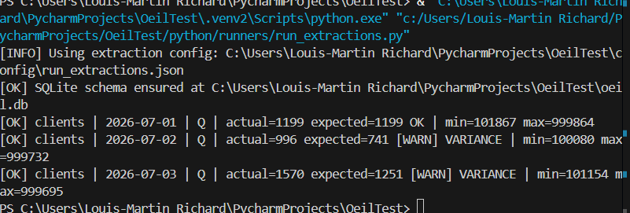
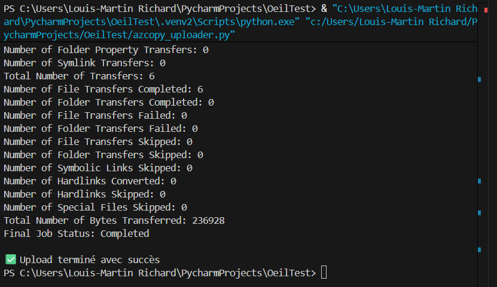
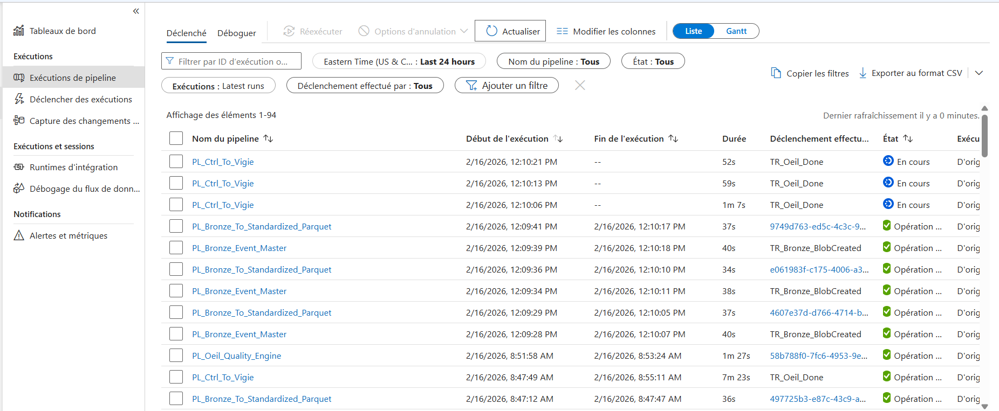
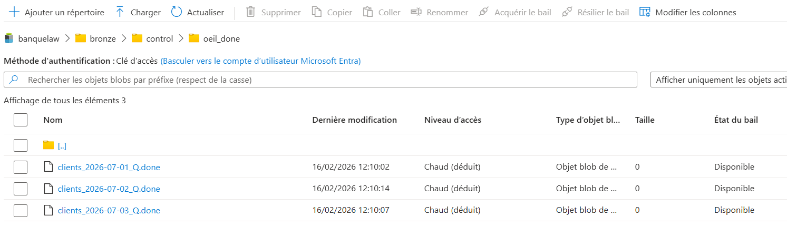
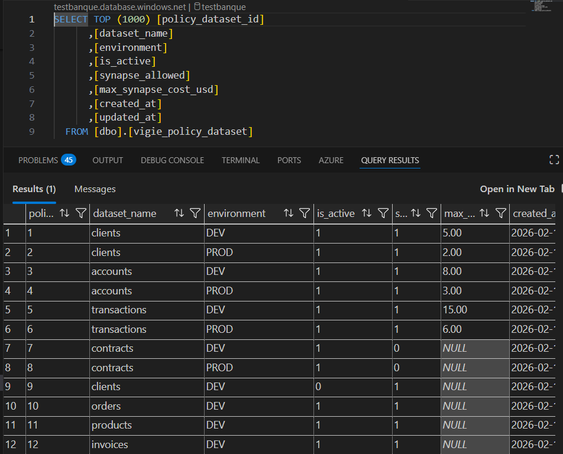
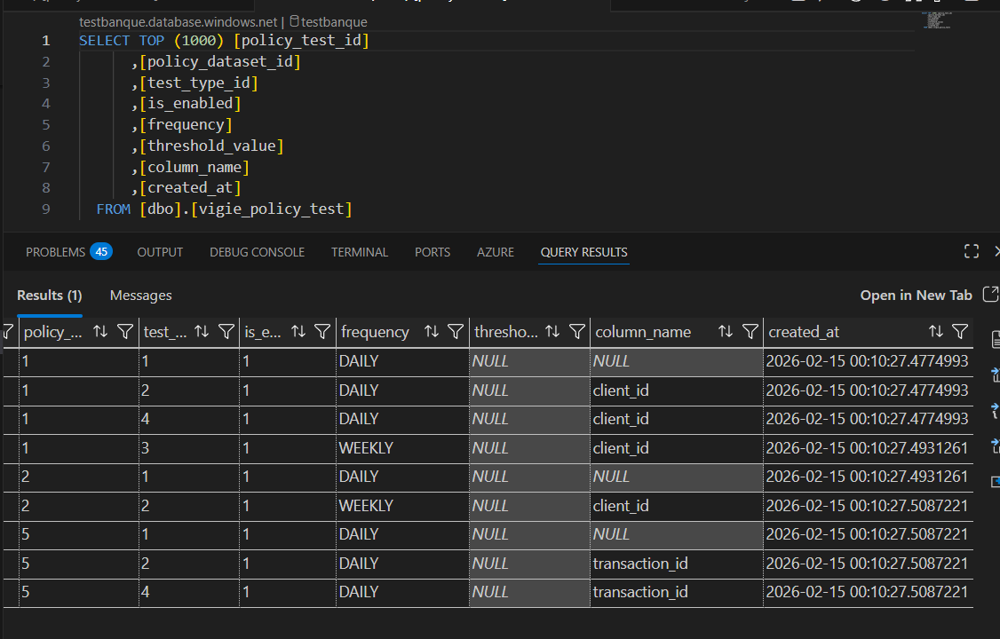

# 🎬 Demo Run — End-to-End

Documentation pas à pas d’un run de démonstration L’ŒIL, avec screenshots.

## Étape 1 — Extraction Python (3 jours, dataset `clients`, chaos 20%)

### Contexte

- Exécution de `python/runners/run_extractions.py`
- Dataset: `clients`
- Fenêtre: 3 jours
- Bruit chaotique (variance): **20%**

### Interprétation métier

Cette étape simule l’**œil gauche** (source/contrat, ex: DataStage ou autre système amont) via les programmes Python.

Avec 20% de bruit, le résultat source simulé peut diverger de la première ingestion attendue. C’est volontaire pour démontrer la capacité de L’ŒIL à détecter et qualifier les écarts.

### Lecture du log (screenshot)

- `actual` = volume réellement généré côté simulation source
- `expected` = volume de référence attendu
- `[WARN] VARIANCE` = écart volontaire injecté (cas de test)
- `min` / `max` = bornes du jeu généré

### Screenshot

> Fichier attendu: `docs/screenshots/demo_step1_extraction_clients_3jours_chaos20.png`

---

## Étape 2 — Push simulé DataStage/SFTP vers le lake (AzCopy)

### Contexte

- Exécution de `azcopy_uploader.py`
- Simulation du transfert amont (DataStage/SFTP) vers ADLS Bronze
- Résultat observé: job `Completed`, transferts fichiers = OK

### Interprétation métier

Cette étape simule l’arrivée des artefacts source dans le lake.

- Le pipeline amont dépose les fichiers attendus en Bronze.
- L’upload réussi confirme que le run peut passer à l’orchestration ADF.
- À ce stade, on valide la disponibilité des entrées, pas encore la qualité métier.

### Lecture du log (screenshot)

- `Final Job Status: Completed` = transfert réussi
- `Number of File Transfers Completed` = nombre de fichiers réellement copiés
- `Failed: 0` / `Skipped: 0` = aucun échec et aucun fichier ignoré

### Screenshot

> Fichier: `docs/screenshots/demo_step2_azcopy_push_lake.png`

---

## Étape 2b — Création de la ligne `ctrl_file_index` après AzCopy

### Contexte

- Après l’upload AzCopy, une entrée de contrôle est enregistrée côté SQL.
- La table `dbo.ctrl_file_index` trace le `ctrl_id`, le `ctrl_path` et le statut de traitement.

### Interprétation métier

Cette étape matérialise le lien entre le dépôt physique des fichiers et l’orchestration aval :

- l’événement est indexé de façon idempotente,
- le run devient traçable avant même les calculs de qualité/SLA,
- le flag `processed_flag` permettra de confirmer la consommation du contrôle en fin de chaîne.

### Screenshot

> Fichier: `docs/screenshots/demo_step2b_ctrl_file_index_created_after_azcopy.png`

---

## Étape 3 — Détection Blob + orchestration `Master -> To_Standardized_Parquet`

### Contexte

- Le trigger Blob détecte l'arrivée des fichiers Bronze.
- `PL_Bronze_Event_Master` est déclenché automatiquement.
- Ce pipeline déclenche `PL_Bronze_To_Standardized_Parquet` pour convertir en Parquet.

### Interprétation métier

Cette étape valide la chaîne d’orchestration event-driven ADF :

- détection automatique de nouveaux fichiers,
- propagation du `ctrl_id` et des métadonnées de partition,
- exécution du pipeline de standardisation sans intervention manuelle.

### Lecture du screenshot

- `PL_Bronze_Event_Master` : point d’entrée déclenché par l’événement Blob.
- `PL_Bronze_To_Standardized_Parquet` : pipeline enfant de transformation.
- Présence de runs `Succeeded` / `In progress` selon le moment de capture.

### Screenshot

> Fichier: `docs/screenshots/demo_step3_adf_blob_trigger_master_to_standardized.png`

---

## Étape 4 — Dépôt du fichier `.done`

### Contexte

- Après la conversion Parquet, le pipeline dépose un fichier `{ctrl_id}.done`.
- Ce fichier signale la fin technique du traitement de la partition Bronze/Standardized.

### Interprétation métier

Le `.done` joue le rôle d’accusé de réception machine-to-machine :

- confirme la complétion de la phase d’ingestion/standardisation,
- autorise les étapes aval (`PL_Ctrl_To_Vigie`, qualité, SLA, alertes),
- facilite l’orchestration idempotente par événement.

### Screenshot

> Fichier: `docs/screenshots/demo_step4_done_file_deposited.png`

---

## Étape 5 — Policy dataset (activation + autorisation Synapse)

### Contexte

- Consultation de la table `dbo.vigie_policy_dataset`.
- Vérification des flags de gouvernance par dataset/environnement.

### Interprétation métier

Cette étape confirme que la policy autorise l’exécution qualité selon les règles attendues :

- `is_active` détermine si le dataset est pris en compte par l’engine,
- `synapse_allowed` décide si les contrôles Synapse peuvent être exécutés,
- `max_synapse_cost_usd` encadre le budget potentiel.

### Screenshot

> Fichier: `docs/screenshots/demo_step5_policy_dataset_synapse_allowed_active.png`

---

## Étape 6 — Policy test (tests activés à exécuter)

### Contexte

- Consultation de `dbo.vigie_policy_test`.
- Vérification des tests activés et de leur fréquence/seuil.

### Interprétation métier

Cette étape fixe **quoi** exécuter pour le run :

- `is_enabled` active/désactive un test,
- `frequency` porte la logique d’applicabilité,
- `threshold_value` et `column_name` paramètrent la règle.

### Screenshot

> Fichier: `docs/screenshots/demo_step6_policy_test_enabled_frequency_threshold.png`

---

## Étape 7 — Cataloge `test_type` (définition des tests)

### Contexte

- Consultation de `dbo.vigie_policy_test_type`.
- Vérification du catalogue de tests disponibles.

### Interprétation métier

Cette étape définit **la nature** des tests exécutables :

- `test_code` normalise le type de contrôle (`ROW_COUNT`, `MIN_MAX`, ...),
- `requires_synapse` indique les tests nécessitant Synapse,
- la jointure avec `vigie_policy_test` détermine le plan d’exécution final.

### Screenshot

> Fichier: `docs/screenshots/demo_step7_policy_test_type_catalog.png`

---

## Étape 8 — Résultats d’intégrité persistés (`vigie_integrity_result`)

### Contexte

- Exécution effective des tests qualité via `PL_Oeil_Quality_Engine`.
- Persistance des résultats techniques dans `dbo.vigie_integrity_result`.

### Interprétation métier

Cette étape matérialise le “résultat magique” du run qualité:

- une ligne par test exécuté (`ROW_COUNT`, `MIN_MAX`),
- statut de test (`PASS`/`FAIL`) visible immédiatement,
- traces numériques (`min_value`, `max_value`, `expected_value`, `delta_value`) exploitables pour audit.

Note importante : pour `ROW_COUNT`, la valeur de comptage est stockée dans `min_value` par convention technique.

### Lecture du screenshot

- Plusieurs `ctrl_id` sur 3 jours (`2026-07-01` à `2026-07-03`) sont présents.
- Les tests `ROW_COUNT` et `MIN_MAX` sont tous marqués `PASS`.
- `delta_value = 0` confirme l'alignement Bronze vs Parquet sur ces runs.

### Screenshot

> Fichier: `docs/screenshots/demo_step8_integrity_results_pass_rowcount_minmax.png`

---

## Étape 9 — Résultat final consolidé (`vigie_ctrl`)

### Tableau de synthèse (lisible métier)

| ctrl_id | expected_rows | bronze_rows | parquet_rows | bronze_status | parquet_status | duration_sec | sla_status | volume_status | alert_level |
|---|---:|---:|---:|---|---|---:|---|---|---|
| clients_2026-07-01_Q | 1199 | 1199 | 1199 | OK | OK | 297 | OK | OK | NO_ALERT |
| clients_2026-07-02_Q | 741 | 996 | 996 | MISMATCH | MISMATCH | 309 | OK | ANOMALY | CRITICAL |
| clients_2026-07-03_Q | 1251 | 1570 | 1570 | MISMATCH | MISMATCH | 306 | OK | ANOMALY | CRITICAL |

### Explication métier du résultat final

- Le pipeline termine bien sur les 3 `ctrl_id` (`status_global = COMPLETED`).
- La performance est conforme (`sla_status = OK` sur les 3 runs).
- La qualité volumétrique détecte correctement 2 anomalies (`volume_status = ANOMALY`), malgré un SLA temps conforme.
- Le moteur d’alerte est cohérent: `alert_level = CRITICAL` uniquement quand une anomalie volumétrique est confirmée.
- Les coûts Synapse restent faibles et traçables (`synapse_cost_estimated_cad`).

### Dictionnaire complet des champs (`vigie_ctrl`)

- `ctrl_id`: identifiant unique du contrôle (dataset + date + périodicité).
- `dataset`: nom du dataset contrôlé.
- `periodicity`: fréquence de traitement (ex: `Q`, `H`, `D`).
- `extraction_date`: date métier de la partition contrôlée.
- `expected_rows`: volume attendu de référence.
- `source_system`: système source métier.
- `created_ts`: timestamp de création initiale du contrôle.
- `pipeline_run_id`: identifiant technique du run ADF.
- `adf_pipeline_name`: nom du pipeline ADF exécuté.
- `adf_trigger_name`: nom du trigger ADF ayant déclenché le run.
- `start_ts`: horodatage de début du cycle ŒIL.
- `status`: statut principal du run dans `vigie_ctrl`.
- `inserted_ts`: horodatage d’insertion de la ligne en base.
- `bronze_rows`: nombre de lignes observé côté Bronze.
- `bronze_delta`: écart Bronze vs attendu (`bronze_rows - expected_rows`).
- `bronze_status`: verdict Bronze (`OK` ou `MISMATCH`).
- `parquet_rows`: nombre de lignes observé côté Parquet.
- `parquet_delta`: écart Parquet vs attendu (`parquet_rows - expected_rows`).
- `parquet_status`: verdict Parquet (`OK` ou `MISMATCH`).
- `status_global`: état global du cycle (ex: `COMPLETED`).
- `sla_expected_sec`: objectif SLA nominal (en secondes).
- `sla_threshold_sec`: seuil maximal SLA accepté (en secondes).
- `end_ts`: horodatage de fin du cycle ŒIL.
- `duration_sec`: durée totale observée du cycle.
- `sla_sec`: valeur SLA globale mesurée.
- `sla_status`: verdict SLA global (`OK` / `BREACH`).
- `sla_reason`: raison de classification SLA globale.
- `volume_status`: verdict volumétrique consolidé (`OK` / `ANOMALY`).
- `sla_bucket`: classe de vitesse (`FAST`, `NORMAL`, ...).
- `row_count_adf_ingestion_copie_parquet`: volume compté pendant l’ingestion ADF/copie Parquet.
- `adf_start_ts`: début du segment ADF.
- `adf_end_ts`: fin du segment ADF.
- `adf_duration_sec`: durée du segment ADF.
- `adf_sla_status`: verdict SLA du segment ADF.
- `adf_sla_reason`: raison SLA du segment ADF.
- `synapse_start_ts`: début du segment Synapse.
- `synapse_end_ts`: fin du segment Synapse.
- `synapse_duration_sec`: durée du segment Synapse.
- `oeil_sla_sec`: SLA mesuré côté exécution ŒIL.
- `oeil_sla_expected_sec`: cible SLA côté ŒIL.
- `oeil_sla_threshold_sec`: seuil SLA côté ŒIL.
- `oeil_sla_status`: verdict SLA côté ŒIL.
- `oeil_sla_reason`: raison SLA côté ŒIL.
- `adf_sla_sec`: SLA mesuré pour ADF.
- `adf_sla_expected_sec`: cible SLA ADF.
- `adf_sla_threshold_sec`: seuil SLA ADF.
- `synapse_sla_sec`: SLA mesuré pour Synapse.
- `synapse_sla_expected_sec`: cible SLA Synapse.
- `synapse_sla_threshold_sec`: seuil SLA Synapse.
- `synapse_sla_status`: verdict SLA Synapse.
- `synapse_sla_reason`: raison SLA Synapse.
- `alert_flag`: indicateur binaire d’alerte (`0`/`1`).
- `alert_reason`: raison textuelle de l’alerte (règles consolidées).
- `alert_ts`: horodatage de levée d’alerte.
- `synapse_cost_estimated_cad`: coût Synapse estimé en CAD.
- `synapse_cost_rate_cad_per_min`: taux de coût appliqué (CAD/min).
- `alert_level`: niveau final d’alerte (`NO_ALERT`, `WARNING`, `CRITICAL`).
- `payload_canonical`: payload normalisé servant à la comparaison.
- `payload_hash_sha256`: hash SHA-256 du payload canonique.
- `payload_hash_version`: version de la méthode de hash.
- `payload_hash_match`: résultat de comparaison de hash.
- `policy_dataset_id`: identifiant de la policy dataset appliquée.
- `policy_snapshot_json`: snapshot JSON de policy figé au moment du run.

---

## Étape 10 — Power BI (Executive Overview)

### Contexte

- Vue exécutive de synthèse pour lecture rapide du run.
- Focus: santé globale, SLA, vitesse des runs, et signal d’alertes.

### Lecture métier du tableau exécutif

- `Runs Total = 3`: les trois partitions du scénario ont été traitées.
- `Runs FAST = 3`: performance globale dans la zone rapide.
- `ADF SLA OK = 3`, `SYNAPSE SLA OK = 3`, `OEIL SLA OK = 3`: conformité temps bout-en-bout.
- `Volume Issue Runs = 2`: deux runs ont été détectés en dérive volumétrique.
- `Volume Integrity Label = Volume Drift Detected`: le dashboard confirme le signal d’anomalie volume déjà visible dans `vigie_ctrl`.

### Message exécutif à porter en démo

Le pipeline est rapide et stable, mais il remonte correctement les écarts volumétriques métier: la plateforme ne masque pas les anomalies sous un simple SLA “vert”.

### Screenshot

> Fichier: `docs/screenshots/demo_step10_powerbi_executive_overview.png`

---

## Étape 11 — Power BI (Volume Watch)

### Contexte

- Vue dédiée au suivi de la qualité volumétrique.
- Sert de point d’entrée pour les futurs drill-down par type de problème.

### Lecture métier

- Permet de suivre les anomalies de volume par run/dataset/période.
- Prépare les analyses détaillées (écarts attendus vs observés, priorisation des incidents).
- Complète la vue exécutive avec un axe “problème d’intégrité” plus opérationnel.

### Screenshot

> Fichier: `docs/screenshots/demo_step11_powerbi_volume_watch.png`

---

✅ Démo end-to-end documentée (version actuelle)

- Chaîne couverte: extraction → ingestion → orchestration ADF → quality engine → consolidation `vigie_ctrl` → visualisation Power BI.
- Évolution prévue: drill-downs Power BI par catégorie de problème (volume, SLA, source d’alerte).

---

Étapes suivantes à documenter au fil des screenshots (optionnel):

1. Drill-down Power BI par problème (volume/SLA/source)
