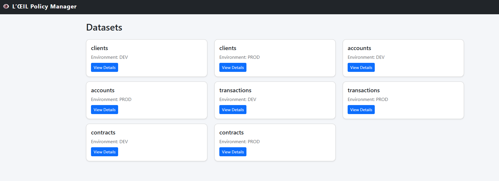
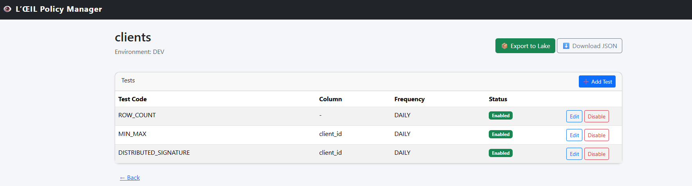

# 🛠️ Oeil Policy Manager

Interface Python pour consulter, exporter et auditer les policies dataset.

Le module est localisé dans `python/oeil_policy_manager/` et fournit:

- une UI web FastAPI + Jinja2,
- un CLI d’export policy,
- un accès Azure SQL via SQLAlchemy,
- un export policy JSON vers le lake via SAS.

## Composants

- `policy_ui.py` : serveur FastAPI (liste datasets, détail, export, download JSON)
- `policy_cli.py` : export policy en ligne de commande
- `policy_repository.py` : requêtes SQL (`vigie_policy_dataset`, `vigie_policy_test`)
- `json_builder.py` : construction du payload policy JSON
- `lake_writer.py` : upload dans le conteneur ADLS via SAS
- `templates/base.html` : layout
- `templates/datasets.html` : vue liste
- `templates/dataset_detail.html` : vue détail

## Variables d’environnement

Définies dans `.env` (racine projet):

- `OEIL_AZURE_SQL_CONN`
- `OEIL_AZCOPY_DEST`
- `OEIL_STORAGE_CONN`
- `OEIL_STORAGE_CONTAINER`

## Lancer l’UI

```bash
uvicorn python.oeil_policy_manager.policy_ui:app --reload
```

URL locale: `http://127.0.0.1:8000`

## Export policy via CLI

```bash
python -m python.oeil_policy_manager.policy_cli --export 1
```

## Captures d’écran

### Vue principale (datasets)



### Vue détail dataset



## Notes de maintenance

- Le module charge désormais `.env` depuis la racine projet pour éviter les variations de cwd.
- Les traces de debug de connexion ont été retirées de `config.py` (pas d’exposition de secrets en console).
- Des commentaires structurels ont été ajoutés dans les templates pour faciliter l’évolution UI.
