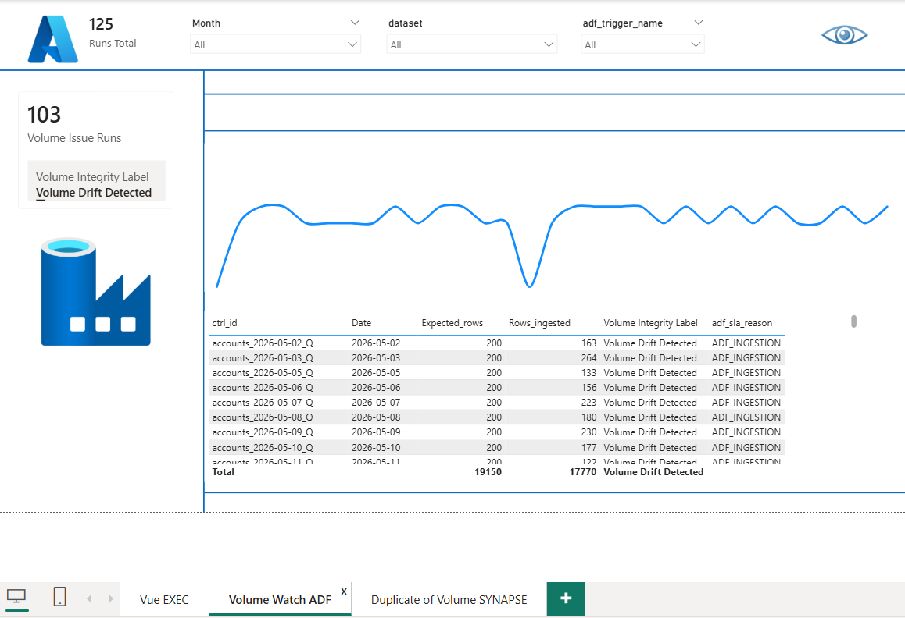
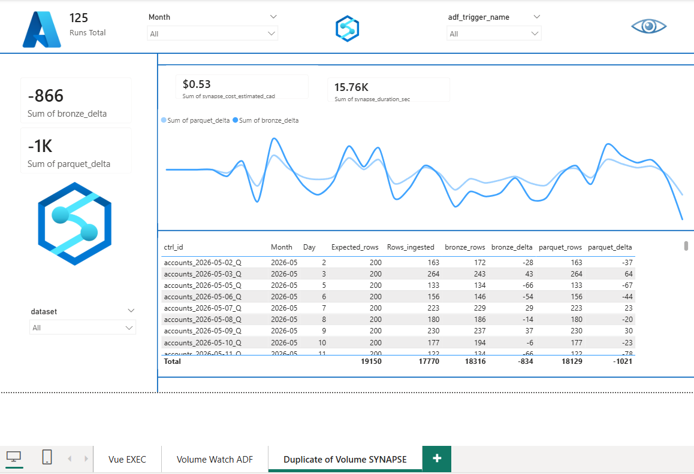

# 📊 Power BI Dashboard

Le dashboard L'ŒIL est l'interface principale de surveillance. Il consolide les métriques de tous les runs d'extraction.

## Indicateurs Clés

### 1. Runs Total

Nombre total de contrôles exécutés dans la période sélectionnée.

-   **FAST** (vert) : Runs exécutés dans le temps prévu par le SLA.Performance optimale.
-   **SLOW** (jaune) : Runs légèrement lents, mais acceptables (SLA warning).
-   **VERY SLOW** (rouge) : Runs critiques dépassant largement le SLA. Nécessitent investigation.

### 2. Santé Globale (SLA Buckets)

Classification des performances par moteur :

-   **ADF** : Temps d'ingestion (volume-dependent).
-   **SYNAPSE** : Temps de compute (fixed overhead).
-   **OEIL** : Temps d'orchestration globale.

### 3. Performance / Durée

Moyenne des temps d'exécution (en secondes) par moteur et par jour. Permet de détecter des dérives progressives.

### 4. Problèmes / Fail

Nombre de runs en erreur technique (status=`FAILED`).

-   **ADF FAIL** : Échec de copie ou timeout.
-   **SYNAPSE FAIL** : Erreur SQL ou timeout compute.
-   **OEIL FAIL** : Erreur logique ou timeout global.

### 5. Volume

Métriques de contrôle des données :

-   **Volume Issue Runs** : Nombre de runs où le volume réel diffère significativement du volume attendu.
-   **Volume Drift Detected** : Détection de tendance anormale (hausse ou baisse continue).

## Nouveaux onglets Volumetric

Deux onglets ont été ajoutés pour le suivi volumétrique détaillé entre l'attendu, Bronze et Parquet.

### 1. Volume Watch ADF (Ingestion Logs)

Objectif : visualiser les écarts d'ingestion ADF par run et identifier rapidement les dérives de volume.

- **Mesure principale** : `Rows_ingested` vs `Expected_rows`.
- **Label d'intégrité** : `Volume Integrity Label` (ex: `Volume Drift Detected`).
- **Cause ADF** : `adf_sla_reason` pour le diagnostic ingestion.

Colonnes clés recommandées :

- `ctrl_id`
- `Date`
- `Expected_rows`
- `Rows_ingested`
- `Volume Integrity Label`
- `adf_sla_reason`

### 2. Volume Watch SYNAPSE (Delta Bronze/Parquet)

Objectif : comparer les écarts de volume calculés après ingestion/compute, côté Bronze et Parquet.

- **Delta Bronze** : `bronze_delta = bronze_rows - expected_rows`
- **Delta Parquet** : `parquet_delta = parquet_rows - expected_rows`
- **Lecture rapide** :
	- valeur positive = sur-volume vs attendu
	- valeur négative = sous-volume vs attendu

Colonnes clés recommandées :

- `ctrl_id`
- `Month`
- `Day`
- `Expected_rows`
- `Rows_ingested`
- `bronze_rows`
- `bronze_delta`
- `parquet_rows`
- `parquet_delta`

## Notes d'intégration screenshots

Ajouter les captures dans `docs/screenshots/` avec ces noms :

- `powerbi_volume_watch_adf.png`
- `powerbi_volume_watch_synapse.png`

## KPI card definitions (standard)

Définitions recommandées pour garder une lecture homogène entre environnements.

### Onglet Volume Watch ADF

- **Runs Total** = `COUNTROWS(vigie_ctrl)`
- **Volume Issue Runs** = nombre de runs où `ABS(Rows_ingested - Expected_rows) > 0`
- **Volume Integrity Label** =
	- `Volume Drift Detected` si `ABS(Rows_ingested - Expected_rows) / NULLIF(Expected_rows,0) > 0.05`
	- sinon `Volume Stable`

### Onglet Volume Watch SYNAPSE

- **Sum bronze_delta** = `SUM(bronze_rows - expected_rows)`
- **Sum parquet_delta** = `SUM(parquet_rows - expected_rows)`
- **Sum synapse_cost_estimated_cad** = `SUM(synapse_cost_estimated_cad)`
- **Sum synapse_duration_sec** = `SUM(synapse_duration_sec)`

### Règles d'interprétation

- Delta > 0 : sur-volume vs attendu
- Delta < 0 : sous-volume vs attendu
- Delta proche de 0 : comportement nominal
