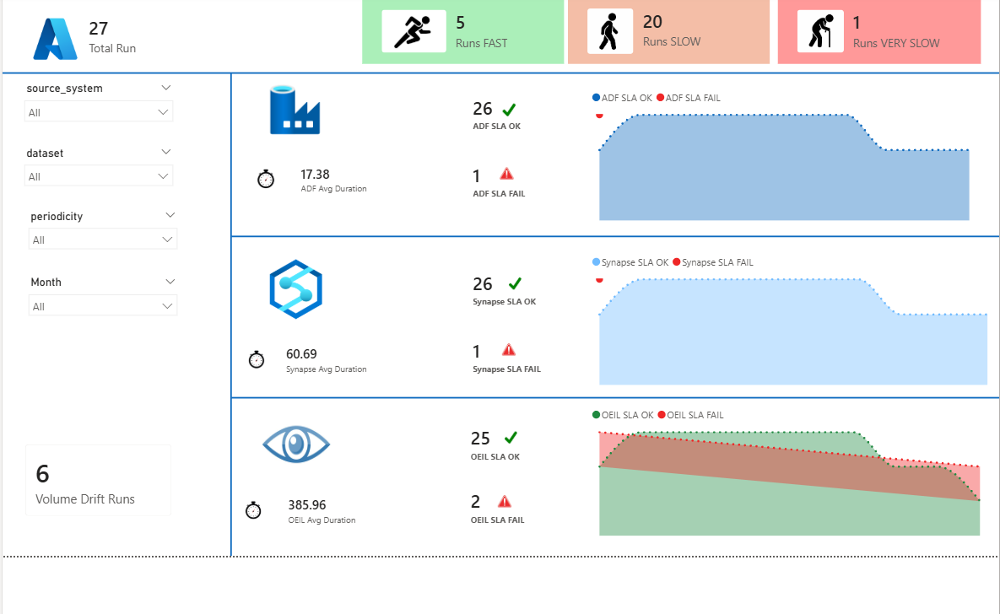
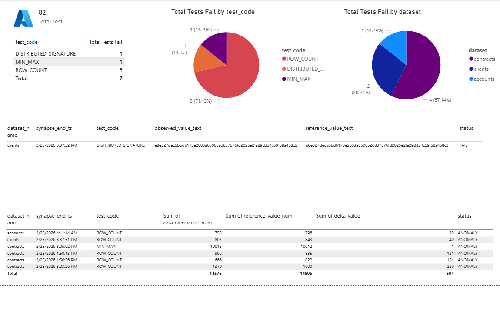
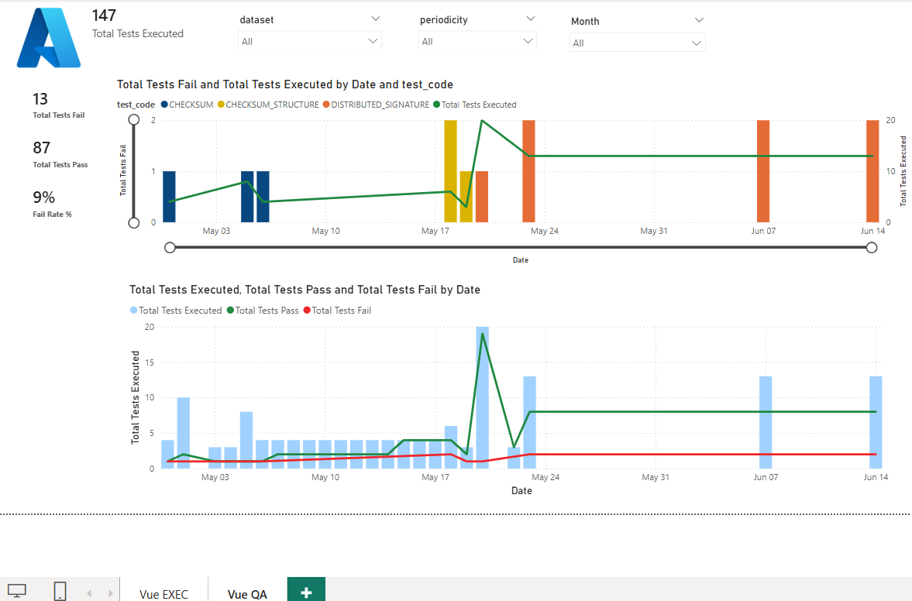

# 📊 Power BI Dashboard

Le dashboard L'ŒIL est l'interface principale de surveillance. Il consolide les métriques de tous les runs d'extraction.

## Vue Executive — Synthèse SLA

**Analyse du graphique :**

- Ce visuel présente la synthèse des SLA pour tous les runs.
- Les indicateurs principaux (FAST, SLOW, VERY SLOW) sont mis en avant, permettant d’identifier rapidement les runs critiques.
- La segmentation par source, dataset, périodicité et mois permet un filtrage dynamique.
- Les tendances de performance et de durée sont visibles sur la période.

## Vue Qualité — Résumé des tests

**Analyse du graphique :**

- Ce visuel résume la qualité globale des tests exécutés.
- On observe le taux de réussite, le taux d’échec, et la répartition par type de test (CHECKSUM, CHECKSUM_STRUCTURE, DISTRIBUTED_SIGNATURE).
- Les pics d’exécution et les variations du taux d’échec sont facilement identifiables.
- Ce résumé permet de piloter la qualité et d’anticiper les dérives.

## Vue QA — Suivi détaillé des tests

**Analyse du graphique :**

- Total Tests Executed : 147 tests exécutés sur la période affichée.
- Total Tests Pass : 87 (ligne verte), Total Tests Fail : 13 (ligne rouge), soit un taux d’échec de 9%.
- Répartition par test_code : Les barres colorées montrent la distribution des tests CHECKSUM, CHECKSUM_STRUCTURE et DISTRIBUTED_SIGNATURE par date.
- Tendance : On observe des pics d’exécution autour du 17 mai et du 14 juin, avec une stabilité du taux de réussite après chaque pic.
- Lecture rapide : La majorité des tests sont des CHECKSUM (bleu), les nouveaux types CHECKSUM_STRUCTURE (jaune) et DISTRIBUTED_SIGNATURE (orange) sont bien intégrés et suivis.

## Indicateurs Clés

### 1. Runs Total

Nombre total de contrôles exécutés dans la période sélectionnée.

-   **FAST** (vert) : Runs exécutés dans le temps prévu par le SLA.Performance optimale.
-   **SLOW** (jaune) : Runs légèrement lents, mais acceptables (SLA warning).
-   **VERY SLOW** (rouge) : Runs critiques dépassant largement le SLA. Nécessitent investigation.

### 2. Santé Globale (SLA Buckets)

Classification des performances par moteur :

-   **ADF** : Temps d'ingestion (volume-dependent).
-   **SYNAPSE** : Temps de compute (fixed overhead).
-   **OEIL** : Temps d'orchestration globale.

### 3. Performance / Durée

Moyenne des temps d'exécution (en secondes) par moteur et par jour. Permet de détecter des dérives progressives.

### 4. Problèmes / Fail

Nombre de runs en erreur technique (status=`FAILED`).

-   **ADF FAIL** : Échec de copie ou timeout.
-   **SYNAPSE FAIL** : Erreur SQL ou timeout compute.
-   **OEIL FAIL** : Erreur logique ou timeout global.

### 5. Volume

Métriques de contrôle des données :

-   **Volume Issue Runs** : Nombre de runs où le volume réel diffère significativement du volume attendu.
-   **Volume Drift Detected** : Détection de tendance anormale (hausse ou baisse continue).

### 6. Qualité (synthèse run)

Métriques de synthèse qualité maintenant disponibles dans `vigie_ctrl` :

- **Quality Status Global** : `quality_status_global` (`PASS`, `WARNING`, `FAIL`).
- **Quality Tests Total** : `quality_tests_total`.
- **Quality Tests Pass** : `quality_tests_pass`.
- **Quality Tests Fail** : `quality_tests_fail`.
- **Quality Tests Warning** : `quality_tests_warning`.

## Nouveaux onglets Volumetric

Deux onglets ont été ajoutés pour le suivi volumétrique détaillé entre l'attendu, Bronze et Parquet.

### 1. Volume Watch ADF (Ingestion Logs)

Objectif : visualiser les écarts d'ingestion ADF par run et identifier rapidement les dérives de volume.

- **Mesure principale** : `Rows_ingested` vs `Expected_rows`.
- **Label d'intégrité** : `Volume Integrity Label` (ex: `Volume Drift Detected`).
- **Cause ADF** : `adf_sla_reason` pour le diagnostic ingestion.

Colonnes clés recommandées :

- `ctrl_id`
- `Date`
- `Expected_rows`
- `Rows_ingested`
- `Volume Integrity Label`
- `adf_sla_reason`

## KPI card definitions (standard)

Définitions recommandées pour garder une lecture homogène entre environnements.

### Onglet Volume Watch ADF

- **Runs Total** = `COUNTROWS(vigie_ctrl)`
- **Volume Issue Runs** = nombre de runs où `ABS(Rows_ingested - Expected_rows) > 0`
- **Volume Integrity Label** =
	- `Volume Drift Detected` si `ABS(Rows_ingested - Expected_rows) / NULLIF(Expected_rows,0) > 0.05`
	- sinon `Volume Stable`

### Onglet Volume Watch SYNAPSE

- **Sum bronze_delta** = `SUM(bronze_rows - expected_rows)`
- **Sum parquet_delta** = `SUM(parquet_rows - expected_rows)`
- **Sum synapse_cost_estimated_cad** = `SUM(synapse_cost_estimated_cad)`
- **Sum synapse_duration_sec** = `SUM(synapse_duration_sec)`

### KPI qualité (option recommandé)

- **Runs Quality FAIL** = `CALCULATE(COUNTROWS(vigie_ctrl), vigie_ctrl[quality_status_global] = "FAIL")`
- **Runs Quality WARNING** = `CALCULATE(COUNTROWS(vigie_ctrl), vigie_ctrl[quality_status_global] = "WARNING")`
- **Runs Quality PASS** = `CALCULATE(COUNTROWS(vigie_ctrl), vigie_ctrl[quality_status_global] = "PASS")`
- **Quality Pass Rate** = `DIVIDE(SUM(vigie_ctrl[quality_tests_pass]), SUM(vigie_ctrl[quality_tests_total]))`

### Règles d'interprétation

- Delta > 0 : sur-volume vs attendu
- Delta < 0 : sous-volume vs attendu
- Delta proche de 0 : comportement nominal
