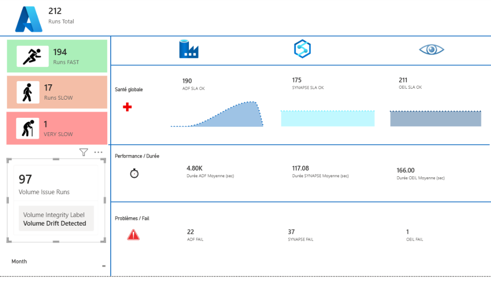

# 👁️ L'ŒIL — Data Quality & Integrity Framework

> **Un moteur de validation configurable, traçable et réutilisable — enterprise-wide.**

L'ŒIL est un framework de contrôle qualité des données conçu pour les environnements Azure. Il orchestre la validation de volumes, de SLA, d'intégrité et de coûts à travers Azure Data Factory, Synapse, Azure SQL et Log Analytics.

## 🧾 Glossaire canonique (rapide)

Pour uniformiser ADF + SQL + reporting, on utilise les clés canoniques suivantes :

- `p_ctrl_id` : identifiant unique du run (`ctrl_id` en base)
- `p_dataset` : dataset métier (`p_table` dans certains pipelines, `dataset_name` dans les résultats d'intégrité)
- `p_periodicity` : fréquence (`p_period` dans certains pipelines)
- `p_extraction_date` : date de référence de la partition

Voir convention complète :
- [ADF Pipelines](technical_reference/adf_pipelines.md)
- [Stored Procedures](technical_reference/stored_procedures.md)

---

## 📚 Documentation

### 🚀 [Getting Started](getting_started.md)
Prerequisites, installation, and how to run your first extraction.

### 🏗️ [Architecture](architecture.md)
High-level overview of components (ADF, SQL, Synapse) and data flow.

### 🧠 Concepts
- **[Framework Capabilities](concepts/framework_capabilities.md)**: v1 vs v2 features.
- **[Control File (CTRL)](concepts/control_file.md)**: The JSON artifact validating each run.
- **[Policy Engine](concepts/policy_engine.md)**: How governance is defined and enforced.
- **[SLA Management](concepts/sla_management.md)**: Calculation logic for ADF, Synapse, and OEIL SLAs.

### ⚙️ Technical Reference
- **[Database Schema](technical_reference/database_schema.md)**: Detailed SQL tables (`vigie_ctrl`, `vigie_policy_*`, etc.).
- **[Stored Procedures](technical_reference/stored_procedures.md)**: Logic for lifecycle and computation.
- **[ADF Pipelines](technical_reference/adf_pipelines.md)**: Ingestion and transformation workflows.

### 📖 Guides
- **[Power BI Dashboard](guides/powerbi_dashboard.md)**: Understanding the monitoring dashboard.
- **[Design Decisions](guides/design_decisions.md)**: Rationale behind key architectural choices.
- **[Release Checklist](guides/release_checklist.md)**: Step-by-step runbook for demo/release execution.

---

## 📊 Dashboard Preview

