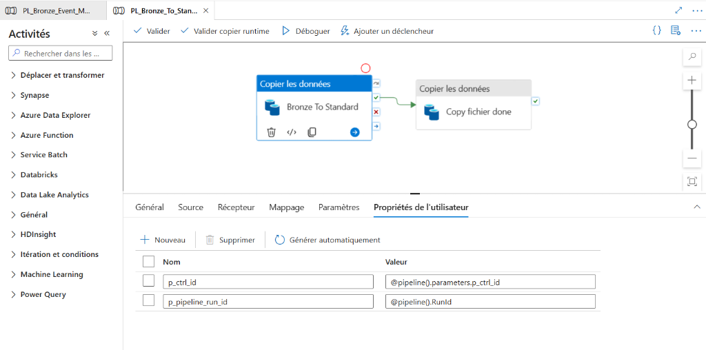

# 🚀 ADF Pipelines

Les pipelines Azure Data Factory sont les moteurs d'ingestion et de transformation.

## 1. `PL_Bronze_Event_Master`

### Rôle : Point d'entrée Event-Driven
Pipeline déclenché automatiquement lors de l'arrivée d'un fichier dans le lake Bronze. Parse le `folderPath` du blob trigger pour en extraire les métadonnées du dataset, puis délègue le traitement à `PL_Bronze_To_Standardized_Parquet`.

### Paramètres

| Paramètre | Source | Description |
|---|---|---|
| `p_folderPath` | Trigger | Chemin complet du blob déclencheur |
| `p_fileName` | Trigger | Nom du fichier déposé |

### Logique de Parsing
Extraction des segments du `folderPath` pour déterminer :

-   `dataset` le nom du dataset.
-   `period`, `year`, `month`, `day` : la date et la fréquence de l'extraction.
-   Génération du `ctrl_id` unique composite (`dataset_date_period`).

---

## 2. `PL_Bronze_To_Standardized_Parquet`

### Rôle : Transformation CSV → Parquet
Pipeline de transformation appelé par `PL_Bronze_Event_Master`. Convertit les CSV du lake Bronze en Parquet standardisé, puis écrit un fichier `.done` comme signal de complétion.

### Flux

1.  **Start Run** : Appelle `SP_Set_Start_TS_OEIL` pour marquer le début du run dans SQL.
2.  **Copy Data** : Copie les données brutes CSV vers le conteneur `standardized` au format Parquet (avec compression Snappy).
3.  **Validation (Optionnelle)** : Vérifie le succès de la copie (row count vs rows copied).
4.  **End Run** : Appelle `SP_Set_End_TS_OEIL` pour clore le run et calculer le SLA.
5.  **Signal Done** : Dépose un fichier `{ctrl_id}.done` à côté du fichier de contrôle Bronze.

### Activités Clés

-   `Copy_Bronze_To_Standardized` : Activité de copie principale.
-   `SP_Set_Start_TS_OEIL` : Appel stored procedure SQL.
-   `SP_Set_End_TS_OEIL` : Appel stored procedure SQL.
-   `Copy_Done_File` : Activité de copie de template `.done`.
