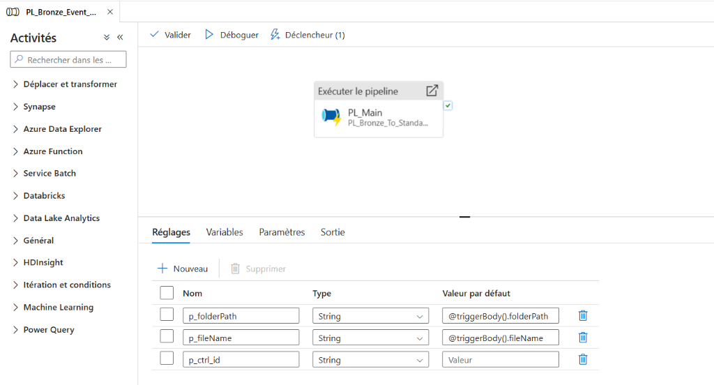
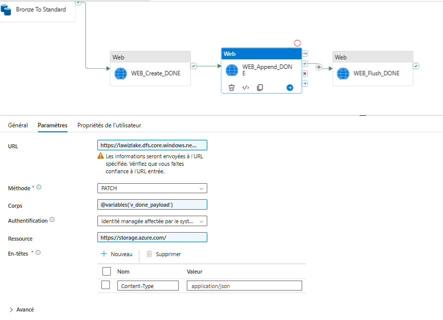
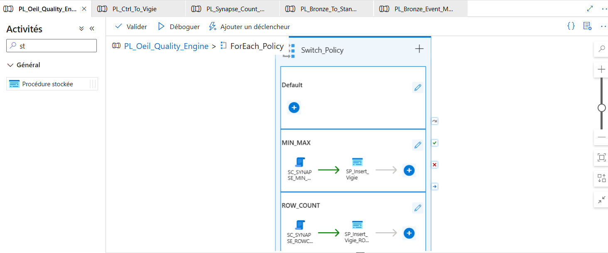
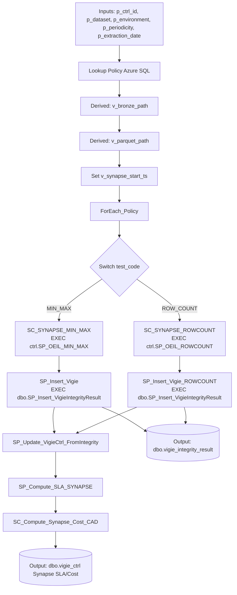
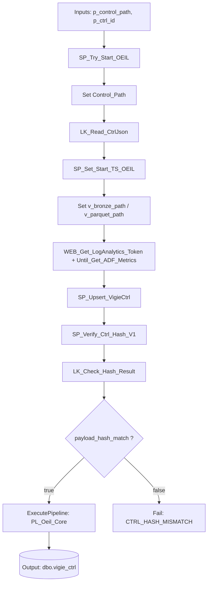
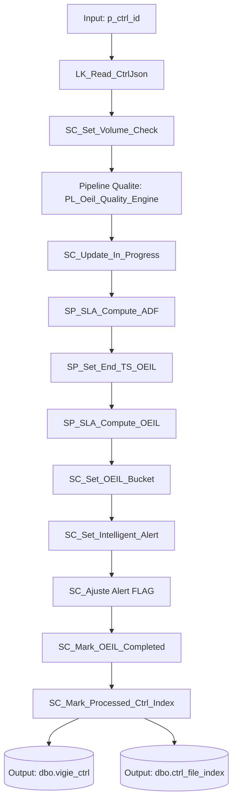

# 🚀 ADF Pipelines

Les pipelines Azure Data Factory sont les moteurs d'ingestion et de transformation.

## Marquage audit

- **[Implemented]** : reflète le JSON pipeline actuel.
- **[Recommended]** : convention d'exploitation/documentation.

## Convention de vocabulaire (cross-docs)

Pour uniformiser la lecture entre ADF, SQL et reporting, les termes canoniques sont :

- `p_ctrl_id`
- `p_dataset`
- `p_periodicity`
- `p_extraction_date`

Quand le nom technique diffère dans un pipeline (ex: `p_table`, `p_period`), il est documenté avec l'équivalence canonique.

## 1. `PL_Bronze_Event_Master`

### Rôle : Point d'entrée Event-Driven
Pipeline déclenché automatiquement lors de l'arrivée d'un fichier dans le lake Bronze. Parse le `folderPath` du blob trigger pour en extraire les métadonnées du dataset, puis délègue le traitement à `PL_Bronze_To_Standardized_Parquet`.



### Paramètres

| Paramètre | Source | Description |
|---|---|---|
| `p_folderPath` | Trigger | Chemin complet du blob déclencheur |
| `p_fileName` | Trigger | Nom du fichier déposé |

### Logique de Parsing
Extraction des segments du `folderPath` pour déterminer :

-   `dataset` (canonique `p_dataset`, implémentation `p_table`) : le nom du dataset.
-   `period` (canonique `p_periodicity`, implémentation `p_period`), `year`, `month`, `day` : la date et la fréquence de l'extraction.
-   Génération du `ctrl_id` unique composite (`dataset_date_period`).

### Input / Output Contract (audit)

| Élément | Type | Contrat |
|---|---|---|
| `p_folderPath` | Input | Chemin blob déclencheur (source vérité de parsing) |
| `p_fileName` | Input | Nom du fichier trigger |
| `p_table` (`p_dataset`) | Derived | Extrait du `folderPath` |
| `p_period` (`p_periodicity`) | Derived | Extrait du `folderPath` |
| `p_year` / `p_month` / `p_day` | Derived | Extraits du `folderPath` |
| `p_ctrl_id` | Derived | Clé composite envoyée au pipeline enfant |
| `PL_Bronze_To_Standardized_Parquet` | Output | Exécution déléguée avec paramètres normalisés |

---

## 2. `PL_Bronze_To_Standardized_Parquet`

### Rôle : Transformation CSV → Parquet
Pipeline de transformation appelé par `PL_Bronze_Event_Master`. Convertit les CSV du lake Bronze en Parquet standardisé, puis écrit un fichier `.done` JSON contenant le `bronze_run_id` pour un pointage KQL robuste.


### Flux

1.  **Build Done Payload** : `V_Payload_ID_Oeil` construit un JSON:
	 - `bronze_run_id = pipeline().RunId`
	 - `ctrl_id = pipeline().parameters.p_ctrl_id`
	 - `completed_ts = utcNow()`
2.  **Copy Data** : `Bronze To Standard` copie les CSV Bronze vers Parquet standardisé.
	 - `userProperties` transportés: `p_ctrl_id` et `p_pipeline_run_id`.
3.  **Create Done File** : `WEB_Create_DONE` crée `.../bronze/control/oeil_done/{ctrl_id}.done` (ADLS Gen2 REST, MSI).
4.  **Append Payload** : `WEB_Append_DONE` écrit le JSON dans le fichier `.done`.
5.  **Flush File** : `WEB_Flush_DONE` finalise le fichier avec la longueur exacte du payload.

Résultat clé: le `p_pipeline_run_id` déposé dans `.done` permet d'interroger Log Analytics sur le run exact (`ADFActivityRun`) même en cas de retry/fail intermédiaire.

### Activités Clés

-   `V_Payload_ID_Oeil` : Compose le payload JSON `.done`.
-   `Bronze To Standard` : Activité de copie principale CSV → Parquet (`CopyBehavior = MergeFiles`).
-   `WEB_Create_DONE` : Crée le fichier `.done` via API ADLS (`PUT`, MSI).
-   `WEB_Append_DONE` : Append le payload JSON (`PATCH action=append`).
-   `WEB_Flush_DONE` : Flush le payload (`PATCH action=flush`).

### Input / Output Contract (audit)

| Élément | Type | Contrat |
|---|---|---|
| `p_table` (`p_dataset`), `p_period` (`p_periodicity`), `p_year`, `p_month`, `p_day` | Input | Identité partition source Bronze |
| `p_ctrl_id` | Input | Identifiant run propagé |
| `enable_synapse_validation` | Input | Paramètre booléen présent (non utilisé dans ce pipeline) |
| `DS_Bronze_CSV` | Input | Source CSV Bronze partitionnée |
| `DS_Standardized_Parquet` | Output | Données standardisées en Parquet |
| `p_pipeline_run_id` (userProperty) | Derived | `pipeline().RunId` pour corrélation KQL |
| `v_done_payload` | Derived | JSON `.done` avec `bronze_run_id`, `ctrl_id`, `completed_ts` |
| `{ctrl_id}.done` | Output | Fichier JSON en `bronze/control/oeil_done/` |

### Screenshots recommandés (ce pipeline)

1. Canvas pipeline (ordre des activités)
	- `docs/screenshots/adf_pl_bronze_to_standardized_parquet_v2_canvas.png`
2. Activité `Bronze To Standard` (onglet `User properties` montrant `p_ctrl_id` + `p_pipeline_run_id`)
	- `docs/screenshots/adf_pl_bronze_to_standardized_parquet_v2_userprops.png`


3. Activités `.done` (`WEB_Create_DONE` → `WEB_Append_DONE` → `WEB_Flush_DONE`) avec statuts `Succeeded`
	- `docs/screenshots/adf_pl_bronze_to_standardized_parquet_v2_done_web_chain.png`



### Exemple réel de payload `.done`

```json
{"bronze_run_id":"6048574b-da8f-4dff-a305-8ff6b4899659","ctrl_id":"transactions_2026-08-04_Q","completed_ts":"2026-02-18T19:13:02.6002697Z"}
```

Ce payload est la source de corrélation entre le run Bronze et la requête KQL (`p_pipeline_run_id`).

---

## 3. `PL_Oeil_Quality_Engine`

### Rôle : Exécuter les policies d'intégrité (Synapse + Azure SQL)

Pipeline de contrôle qualité piloté par policy SQL. Il lit les tests actifs pour un dataset/environnement, exécute les contrôles via Synapse, puis persiste les résultats dans `dbo.vigie_integrity_result`.



### Paramètres

| Paramètre | Type | Description |
|---|---|---|
| `p_ctrl_id` | string | Identifiant run (ex: `clients_2026-05-01_Q`) |
| `p_dataset` | string | Dataset ciblé |
| `p_environment` | string | Environnement policy (`DEV`/`PROD`) |
| `p_periodicity` | string | Périodicité (`Q`, `H`, `M`, etc.) |
| `p_extraction_date` | string | Date d'extraction (`YYYY-MM-DD`) |

### Variables calculées

| Variable | Description |
|---|---|
| `v_bronze_path` | Pattern CSV Bronze (`bronze/<dataset>/period=<p>/year=.../data/*.csv`) |
| `v_parquet_path` | Pattern Parquet standardized (`standardized/<dataset>/year=.../*.parquet`) |
| `v_synapse_start_ts` | Horodatage de début de la phase Synapse (capturé avant `ForEach_Policy`) |

### Flux d'exécution

1. **Lookup Policy**
	 - Requête SQL sur `vigie_policy_dataset`, `vigie_policy_test`, `vigie_policy_test_type`
	 - Filtre: dataset + environment + tests actifs
2. **Set `v_bronze_path`**
3. **Set `v_parquet_path`**
4. **Set `v_synapse_start_ts`**
5. **ForEach_Policy** sur les tests actifs
6. **Switch_Policy** par `test_code`
	 - Cas `MIN_MAX`
		 - `SC_SYNAPSE_MIN_MAX` → `EXEC ctrl.SP_OEIL_MIN_MAX ...`
		 - `SP_Insert_Vigie` → `EXEC dbo.SP_Insert_VigieIntegrityResult ...`
	 - Cas `ROW_COUNT`
		 - `SC_SYNAPSE_ROWCOUNT` → `EXEC ctrl.SP_OEIL_ROWCOUNT ...`
		 - `SP_Insert_Vigie_ROWCOUNT` → `EXEC dbo.SP_Insert_VigieIntegrityResult ...`
7. **`SP_Update_VigieCtrl_FromIntegrity`**
	 - Synchronise les résultats `ROW_COUNT` d'intégrité vers `dbo.vigie_ctrl`
	 - Alimente `synapse_start_ts`, `synapse_end_ts`, `synapse_duration_sec`, `row_count_adf_ingestion_copie_parquet`, `status`
8. **`SP_Compute_SLA_SYNAPSE`**
	 - Calcule le SLA Synapse à partir de la durée consolidée
9. **`SC_Compute_Synapse_Cost_CAD_copy1`**
	 - Estime le coût Synapse et met à jour `synapse_cost_estimated_cad`

### Diagramme Mermaid (flow)



### Résultat attendu

- Une ligne par test exécuté dans `dbo.vigie_integrity_result`.
- Colonnes clés alimentées: `ctrl_id` (`p_ctrl_id`), `dataset_name` (`p_dataset`), `test_code`, `column_name`, `min_value`, `max_value`, `expected_value`, `delta_value`, `status`, `execution_time_ms`, `created_at`.

### Input / Output Contract (audit)

| Élément | Type | Contrat |
|---|---|---|
| `p_ctrl_id` | Input | ID unique du run de contrôle |
| `p_dataset` | Input | Dataset cible des tests |
| `p_environment` | Input | Scope des policies actives |
| `p_periodicity` | Input | Fréquence logique du run |
| `p_extraction_date` | Input | Date de référence pour construire les paths Bronze/Parquet |
| `v_bronze_path` | Derived | Pattern source CSV Bronze |
| `v_parquet_path` | Derived | Pattern source Parquet Standardized |
| `v_synapse_start_ts` | Derived | Start timestamp de la phase Synapse |
| `Lookup Policy` | Derived | Liste des tests actifs (`ROW_COUNT`, `MIN_MAX`, etc.) |
| `dbo.vigie_integrity_result` | Output | Une ligne persistée par test exécuté |
| `SP_Update_VigieCtrl_FromIntegrity` | Output | Synchronisation des métriques d'intégrité vers `vigie_ctrl` |
| `dbo.vigie_ctrl` | Output | Colonnes Synapse enrichies (`synapse_*`, `status`, rowcount) |
| `synapse_cost_estimated_cad` | Output | Coût Synapse estimé sur le run |
| `status` | Output | `PASS` / `FAIL` (retour Synapse) |
| `delta_value` | Output | Écart calculé (0 attendu sur run nominal) |
| `execution_time_ms` | Output | Durée mesurée de l'exécution du test |

---

## 4. `PL_Oeil_Guardian`

### Rôle : Préparation run + garde d’intégrité CTRL

Pipeline d’entrée qui lit le CTRL JSON, alimente `dbo.vigie_ctrl` avec les métadonnées et métriques ADF, puis applique une garde hash canonique avant d’autoriser le cœur métier.

L’ancien pipeline `PL_Ctrl_To_Vigie` est retiré du design actif.

### Dépendances ADF / Log Analytics (polling) [Implemented]

Pour fiabiliser la récupération des métriques d'ingestion :

- Le polling est géré par `Until_Get_ADF_Metrics`.
- Timeout de boucle : `00:05:00`.
- Retry activité : `0` (pas de retry ADF natif sur cette étape).
- Backoff : fixe via `Wait 30 sec` tant que la métrique n'est pas disponible.
- Critère de métrique ADF valide : `row_count_adf_ingestion_copie_parquet` non nul (avec `adf_start_ts`, `adf_end_ts`, `adf_duration_sec` issus de la même requête KQL).
- La requête KQL cible désormais `UserProperties.p_pipeline_run_id` (run id déposé dans le `.done`) pour pointer le run exact et éviter les collisions en cas de retry.

### Activités clés (vue simplifiée)

- `SP_Try_Start_OEIL`
- `Set Control_Path` → `LK_Read_CtrlJson`
- `SP_Set_Start_TS_OEIL`
- `WEB_Get_LogAnalytics_Token` + `Until_Get_ADF_Metrics`
- `SP_Upsert_VigieCtrl`
- `SP_Verify_Ctrl_Hash_V1`
- `LK_Check_Hash_Result`
- `If le HASH du CTRL est OK`
	- vrai → `Execute Pipeline OEIL CORE` (`PL_Oeil_Core`)
	- faux → `Fail CTRL_HASH_MISMATCH`

### Hash canonique CTRL [Implemented]

- Le pipeline appelle `SP_Verify_Ctrl_Hash_V1`.
- La décision d’orchestration est basée sur `payload_hash_match` dans `dbo.vigie_ctrl`.
- Si `payload_hash_match = false`, le pipeline échoue volontairement avec `CTRL_HASH_MISMATCH`.
- Le canonical V1 vérifié est `dataset|periodicity|YYYY-MM-DD|expected_rows`.
- Le hash recalculé utilise `SHA2_256` (hex lowercase, sans `0x`).
- Le contrôle alimente aussi `alert_flag` et `alert_reason` (`HASH_OK`, `MISSING_HASH`, `CTRL_HASH_MISMATCH`).

### Diagramme Mermaid (flow)



### Input / Output Contract (audit)

| Élément | Type | Contrat |
|---|---|---|
| `p_control_path` | Input | Paramètre déclaré (chemin effectif reconstruit depuis `p_ctrl_id`) |
| `p_ctrl_id` | Input | Clé de run à enrichir et valider |
| `v_control_path`, `v_bronze_path`, `v_parquet_path` | Derived | Chemins techniques normalisés |
| `row_count_adf_ingestion_copie_parquet` | Derived | Métrique ingestion issue de KQL |
| `payload_canonical`, `payload_hash_sha256`, `payload_hash_version` | Input (CTRL) | Valeurs lues du CTRL JSON |
| `payload_hash_match` | Output | Résultat booléen de validation hash canonique |
| `PL_Oeil_Core` | Output | Exécution autorisée seulement si hash valide |
| `dbo.vigie_ctrl` | Output | Run enrichi (ADF + hash + lifecycle) |

---

## 5. `PL_Oeil_Core`

### Rôle : Cœur qualité / SLA / alertes

Sous-pipeline appelé par `PL_Oeil_Guardian` après validation hash. Il enchaîne les calculs volumétriques, l’exécution qualité, les SLA et la consolidation des alertes.

### Activités clés (vue simplifiée)

- `LK_Read_CtrlJson`
- `SC_Set_Volume_Check`
- `Pipeline Qualite` → `PL_Oeil_Quality_Engine`
- `SC_Update_In_Progress`
- `SP_SLA_Compute_ADF`
- `SP_Set_End_TS_OEIL`
- `SP_SLA_Compute_OEIL`
- `SC_Set_OEIL_Bucket`
- `SC_Set_Intelligent_Alert`
- `SC_Ajuste Alert FLAG`
- `SC_Mark_OEIL_Completed`
- `SC_Mark_Processed_Ctrl_Index`

### Diagramme Mermaid (flow)



### Input / Output Contract (audit)

| Élément | Type | Contrat |
|---|---|---|
| `p_ctrl_id` | Input | Clé de run à finaliser |
| `LK_Read_CtrlJson` | Derived | Dataset/periodicity/extraction_date utilisés pour exécuter la qualité |
| `PL_Oeil_Quality_Engine` | Output | Exécution qualité Synapse pilotée par policy |
| `dbo.vigie_ctrl` | Output | Run enrichi (volume status, SLA, bucket, alert, status_global) |
| `dbo.ctrl_file_index` | Output | Flag `processed_flag=1`, `processed_ts` |
