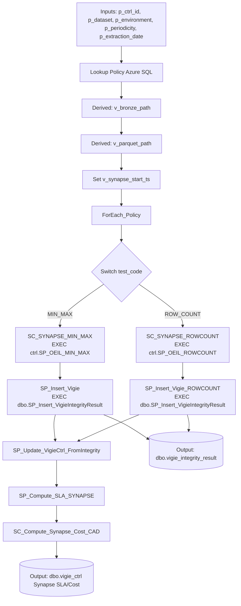
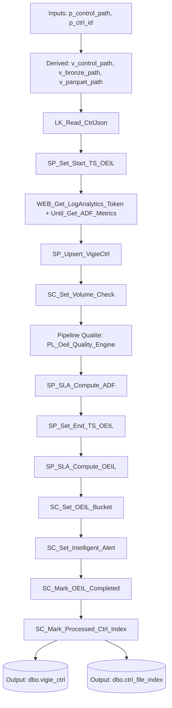

# 🚀 ADF Pipelines

Les pipelines Azure Data Factory sont les moteurs d'ingestion et de transformation.

## Convention de vocabulaire (cross-docs)

Pour uniformiser la lecture entre ADF, SQL et reporting, les termes canoniques sont :

- `p_ctrl_id`
- `p_dataset`
- `p_periodicity`
- `p_extraction_date`

Quand le nom technique diffère dans un pipeline (ex: `p_table`, `p_period`), il est documenté avec l'équivalence canonique.

## 1. `PL_Bronze_Event_Master`

### Rôle : Point d'entrée Event-Driven
Pipeline déclenché automatiquement lors de l'arrivée d'un fichier dans le lake Bronze. Parse le `folderPath` du blob trigger pour en extraire les métadonnées du dataset, puis délègue le traitement à `PL_Bronze_To_Standardized_Parquet`.

### Paramètres

| Paramètre | Source | Description |
|---|---|---|
| `p_folderPath` | Trigger | Chemin complet du blob déclencheur |
| `p_fileName` | Trigger | Nom du fichier déposé |

### Logique de Parsing
Extraction des segments du `folderPath` pour déterminer :

-   `dataset` (canonique `p_dataset`, implémentation `p_table`) : le nom du dataset.
-   `period` (canonique `p_periodicity`, implémentation `p_period`), `year`, `month`, `day` : la date et la fréquence de l'extraction.
-   Génération du `ctrl_id` unique composite (`dataset_date_period`).

### Input / Output Contract (audit)

| Élément | Type | Contrat |
|---|---|---|
| `p_folderPath` | Input | Chemin blob déclencheur (source vérité de parsing) |
| `p_fileName` | Input | Nom du fichier trigger |
| `p_table` (`p_dataset`) | Derived | Extrait du `folderPath` |
| `p_period` (`p_periodicity`) | Derived | Extrait du `folderPath` |
| `p_year` / `p_month` / `p_day` | Derived | Extraits du `folderPath` |
| `p_ctrl_id` | Derived | Clé composite envoyée au pipeline enfant |
| `PL_Bronze_To_Standardized_Parquet` | Output | Exécution déléguée avec paramètres normalisés |

---

## 2. `PL_Bronze_To_Standardized_Parquet`

### Rôle : Transformation CSV → Parquet
Pipeline de transformation appelé par `PL_Bronze_Event_Master`. Convertit les CSV du lake Bronze en Parquet standardisé, puis écrit un fichier `.done` comme signal de complétion.

### Flux

1.  **Start Run** : Appelle `SP_Set_Start_TS_OEIL` pour marquer le début du run dans SQL.
2.  **Copy Data** : Copie les données brutes CSV vers le conteneur `standardized` au format Parquet (avec compression Snappy).
3.  **Validation (Optionnelle)** : Vérifie le succès de la copie (row count vs rows copied).
4.  **End Run** : Appelle `SP_Set_End_TS_OEIL` pour clore le run et calculer le SLA.
5.  **Signal Done** : Dépose un fichier `{ctrl_id}.done` à côté du fichier de contrôle Bronze.

### Activités Clés

-   `Copy_Bronze_To_Standardized` : Activité de copie principale.
-   `SP_Set_Start_TS_OEIL` : Appel stored procedure SQL.
-   `SP_Set_End_TS_OEIL` : Appel stored procedure SQL.
-   `Copy_Done_File` : Activité de copie de template `.done`.

### Input / Output Contract (audit)

| Élément | Type | Contrat |
|---|---|---|
| `p_table` (`p_dataset`), `p_period` (`p_periodicity`), `p_year`, `p_month`, `p_day` | Input | Identité partition source Bronze |
| `p_ctrl_id` | Input | Identifiant run propagé |
| `DS_Bronze_CSV` | Input | Source CSV Bronze partitionnée |
| `DS_Standardized_Parquet` | Output | Données standardisées en Parquet |
| `{ctrl_id}.done` | Output | Signal de complétion en dossier control Bronze |

---

## 3. `PL_Oeil_Quality_Engine`

### Rôle : Exécuter les policies d'intégrité (Synapse + Azure SQL)

Pipeline de contrôle qualité piloté par policy SQL. Il lit les tests actifs pour un dataset/environnement, exécute les contrôles via Synapse, puis persiste les résultats dans `dbo.vigie_integrity_result`.

### Paramètres

| Paramètre | Type | Description |
|---|---|---|
| `p_ctrl_id` | string | Identifiant run (ex: `clients_2026-05-01_Q`) |
| `p_dataset` | string | Dataset ciblé |
| `p_environment` | string | Environnement policy (`DEV`/`PROD`) |
| `p_periodicity` | string | Périodicité (`Q`, `H`, `M`, etc.) |
| `p_extraction_date` | string | Date d'extraction (`YYYY-MM-DD`) |

### Variables calculées

| Variable | Description |
|---|---|
| `v_bronze_path` | Pattern CSV Bronze (`bronze/<dataset>/period=
/year=.../data/*.csv`) |
| `v_parquet_path` | Pattern Parquet standardized (`standardized/<dataset>/year=.../*.parquet`) |
| `v_synapse_start_ts` | Horodatage de début de la phase Synapse (capturé avant `ForEach_Policy`) |

### Flux d'exécution

1. **Lookup Policy**
	 - Requête SQL sur `vigie_policy_dataset`, `vigie_policy_test`, `vigie_policy_test_type`
	 - Filtre: dataset + environment + tests actifs
2. **Set `v_bronze_path`**
3. **Set `v_parquet_path`**
4. **Set `v_synapse_start_ts`**
5. **ForEach_Policy** sur les tests actifs
6. **Switch_Policy** par `test_code`
	 - Cas `MIN_MAX`
		 - `SC_SYNAPSE_MIN_MAX` → `EXEC ctrl.SP_OEIL_MIN_MAX ...`
		 - `SP_Insert_Vigie` → `EXEC dbo.SP_Insert_VigieIntegrityResult ...`
	 - Cas `ROW_COUNT`
		 - `SC_SYNAPSE_ROWCOUNT` → `EXEC ctrl.SP_OEIL_ROWCOUNT ...`
		 - `SP_Insert_Vigie_ROWCOUNT` → `EXEC dbo.SP_Insert_VigieIntegrityResult ...`
7. **`SP_Update_VigieCtrl_FromIntegrity`**
	 - Synchronise les résultats `ROW_COUNT` d'intégrité vers `dbo.vigie_ctrl`
	 - Alimente `synapse_start_ts`, `synapse_end_ts`, `synapse_duration_sec`, `row_count_adf_ingestion_copie_parquet`, `status`
8. **`SP_Compute_SLA_SYNAPSE`**
	 - Calcule le SLA Synapse à partir de la durée consolidée
9. **`SC_Compute_Synapse_Cost_CAD_copy1`**
	 - Estime le coût Synapse et met à jour `synapse_cost_estimated_cad`

### Diagramme Mermaid (flow)

### Résultat attendu

- Une ligne par test exécuté dans `dbo.vigie_integrity_result`.
- Colonnes clés alimentées: `ctrl_id` (`p_ctrl_id`), `dataset_name` (`p_dataset`), `test_code`, `column_name`, `min_value`, `max_value`, `expected_value`, `delta_value`, `status`, `execution_time_ms`, `created_at`.

### Input / Output Contract (audit)

| Élément | Type | Contrat |
|---|---|---|
| `p_ctrl_id` | Input | ID unique du run de contrôle |
| `p_dataset` | Input | Dataset cible des tests |
| `p_environment` | Input | Scope des policies actives |
| `p_periodicity` | Input | Fréquence logique du run |
| `p_extraction_date` | Input | Date de référence pour construire les paths Bronze/Parquet |
| `v_bronze_path` | Derived | Pattern source CSV Bronze |
| `v_parquet_path` | Derived | Pattern source Parquet Standardized |
| `v_synapse_start_ts` | Derived | Start timestamp de la phase Synapse |
| `Lookup Policy` | Derived | Liste des tests actifs (`ROW_COUNT`, `MIN_MAX`, etc.) |
| `dbo.vigie_integrity_result` | Output | Une ligne persistée par test exécuté |
| `SP_Update_VigieCtrl_FromIntegrity` | Output | Synchronisation des métriques d'intégrité vers `vigie_ctrl` |
| `dbo.vigie_ctrl` | Output | Colonnes Synapse enrichies (`synapse_*`, `status`, rowcount) |
| `synapse_cost_estimated_cad` | Output | Coût Synapse estimé sur le run |
| `status` | Output | `PASS` / `FAIL` (retour Synapse) |
| `delta_value` | Output | Écart calculé (0 attendu sur run nominal) |
| `execution_time_ms` | Output | Durée mesurée de l'exécution du test |

---

## 4. `PL_Ctrl_To_Vigie`

### Rôle : Orchestration CTRL → Vigie (métriques ADF + pilotage qualité)

Pipeline de consolidation qui lit le CTRL JSON Bronze, met à jour `dbo.vigie_ctrl`, récupère les métriques ADF, déclenche `PL_Oeil_Quality_Engine` (Synapse centralisé), puis finalise SLA/buckets/alertes.

Note de review:

- `p_control_path` est encore déclaré mais le chemin effectif est reconstruit depuis `p_ctrl_id` dans `Set Control_Path`.
- `p_environment` n'est pas passé explicitement au `PL_Oeil_Quality_Engine` dans cet appel (le pipeline qualité applique donc sa valeur par défaut).

### Activités clés (vue simplifiée)

- `LK_Read_CtrlJson`
- `SP_Upsert_VigieCtrl`
- `SP_Set_Start_TS_OEIL` / `SP_Set_End_TS_OEIL`
- `SP_SLA_Compute_ADF` / `SP_SLA_Compute_OEIL`
- `Pipeline Qualite` → `PL_Oeil_Quality_Engine`
- `SC_Set_Intelligent_Alert`
- `SC_Mark_Processed_Ctrl_Index` (`ctrl_file_index.processed_flag = 1`)

### Diagramme Mermaid (flow)

### Input / Output Contract (audit)

| Élément | Type | Contrat |
|---|---|---|
| `p_control_path` | Input | Paramètre legacy (non utilisé dans la version actuelle du flow) |
| `p_ctrl_id` | Input | Clé de run à enrichir |
| `v_control_path`, `v_bronze_path`, `v_parquet_path` | Derived | Chemins techniques normalisés |
| `PL_Oeil_Quality_Engine` | Output | Exécution qualité (Synapse uniquement dans ce pipeline) |
| `dbo.vigie_ctrl` | Output | Run enrichi (rowcount, SLA, bucket, alert) |
| `dbo.ctrl_file_index` | Output | Flag `processed_flag=1`, `processed_ts` |
