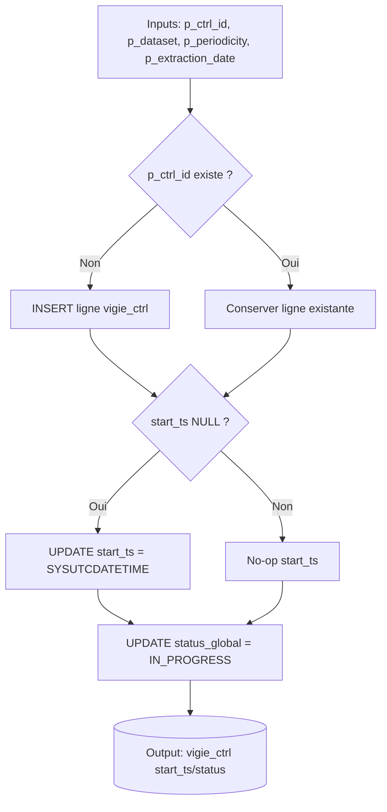
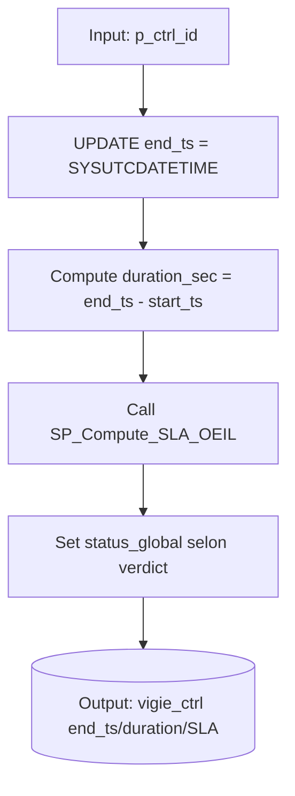
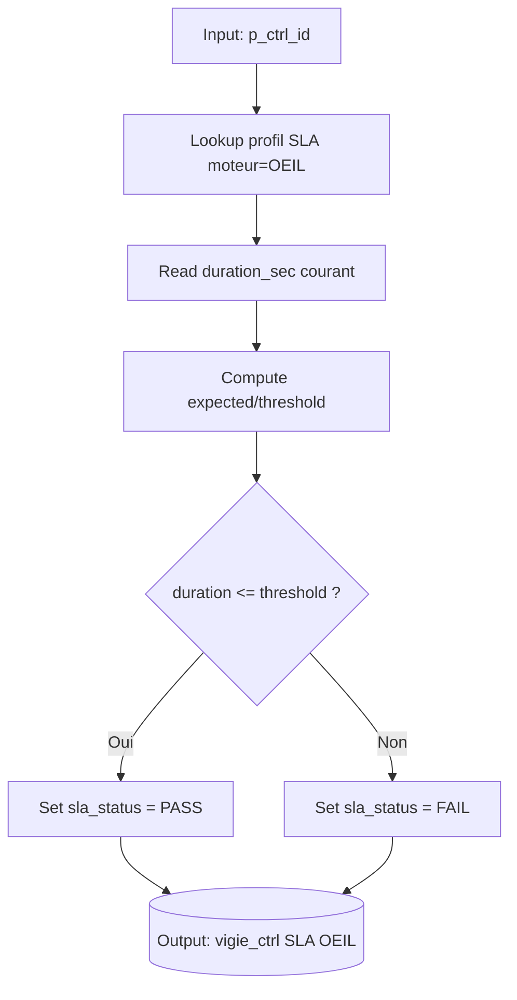
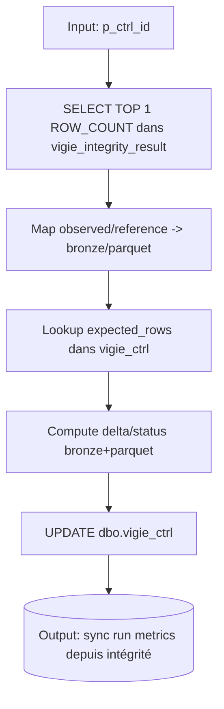

# ⚙️ Stored Procedures

Les procédures stockées Azure SQL sont les points d'intégration pour les calculateurs de SLA et le lifecycle du framework.

## Convention de vocabulaire (cross-docs)

Termes canoniques utilisés dans la documentation : `p_ctrl_id`, `p_dataset`, `p_periodicity`, `p_extraction_date`.

| Canonique (docs) | Paramètre SQL (SP) | Paramètre ADF | Colonne SQL fréquente |
|---|---|---|---|
| `p_ctrl_id` | `@ctrl_id` | `p_ctrl_id` | `ctrl_id` |
| `p_dataset` | `@dataset` | `p_dataset` / `p_table` | `dataset_name` |
| `p_periodicity` | `@periodicity` | `p_periodicity` / `p_period` | `periodicity` |
| `p_extraction_date` | `@extraction_date` | `p_extraction_date` | `extraction_date` |

| Procédure | Rôle | Moteur | Profil SLA | Formule |
|---|---|---|---|---|
| `SP_Set_Start_TS_OEIL` | ⏱️ Lifecycle | — | — | Crée la ligne si elle n'existe pas, pose `start_ts`. Idempotent. |
| `SP_Set_End_TS_OEIL` | ⏱️ Lifecycle | **OEIL** | `EXECUTION_TYPE` | Pose `end_ts`, calcule `duration_sec`, évalue SLA OEIL. |
| `SP_Compute_SLA_ADF` | 📊 Calcul | **ADF** | `EXECUTION_TYPE` | Lit métriques KQL (`row_count`, `duration`), calcule SLA volume-based. |
| `SP_Compute_SLA_SYNAPSE` | 📊 Calcul | **SYNAPSE** | `EXECUTION_TYPE` | Lit durée Synapse, calcule SLA fixed overhead. |
| `SP_Compute_SLA_OEIL` | 📊 Calcul | **OEIL** | `EXECUTION_TYPE` | Appelé en interne par `SP_Set_End`, mais peut être rappelé pour recalcul. |
| `SP_Compute_SLA_Vigie` | 📊 Calcul | **GLOBAL** | `DATASET` (futur) | Calcul SLA global par dataset (plus fin que par moteur). |
| `SP_Update_VigieCtrl_FromIntegrity` | 🔁 Sync qualité → run | **OEIL** | — | Reprend le dernier `ROW_COUNT` de `vigie_integrity_result`, compare à `expected_rows` et met à jour `vigie_ctrl` (bronze/parquet/timestamps/status). |
| `SP_Verify_Ctrl_Hash_V1` | 🔒 Intégrité CTRL | **OEIL** | — | Vérifie la cohérence du hash canonique CTRL et met à jour `payload_hash_match` dans `vigie_ctrl`. |

## Parameters and Logic

### `SP_Set_Start_TS_OEIL`

```sql
@ctrl_id NVARCHAR(200),
@dataset NVARCHAR(100),
@periodicity NVARCHAR(10),
@extraction_date DATE
```

1.  **INSERT** si `ctrl_id` n'existe pas.
2.  **UPDATE** `start_ts` si NULL.
3.  Set `status_global` = 'IN_PROGRESS'.

### `SP_Set_End_TS_OEIL`

```sql
@ctrl_id NVARCHAR(200)
```

1.  Capture `SYSUTCDATETIME()` → `end_ts`.
2.  Calcule durée totale.
3.  Charge profil SLA (OEIL).
4.  Évalue PASS/FAIL.
5.  Set `status_global` = 'SUCCEEDED' (selon outcome).

### `SP_Compute_SLA_ADF`

```sql
@ctrl_id NVARCHAR(200),
@row_count INT,
@duration_sec INT
```

1.  Charge profil SLA (ADF).
2.  Calcule `expected = overhead + (rows/1000 * cost)`.
3.  Compare `duration` vs `threshold`.
4.  Update `vigie_ctrl` avec verdict.

### `SP_Insert_VigieIntegrityResult`

```sql
@ctrl_id NVARCHAR(150),
@dataset_name NVARCHAR(150),
@test_code NVARCHAR(50),
@column_name NVARCHAR(150) = NULL,

@bronze_value FLOAT = NULL,
@bronze_aux_value FLOAT = NULL,
@parquet_value FLOAT = NULL,
@parquet_aux_value FLOAT = NULL,

@status NVARCHAR(30),
@execution_time_ms INT = NULL,

@synapse_start_ts DATETIME2 = NULL,
@synapse_end_ts DATETIME2 = NULL,

@observed_value_text NVARCHAR(500) = NULL,
@reference_value_text NVARCHAR(500) = NULL
```

1.  Calcule `delta_value = ABS(@bronze_value - @parquet_value)` quand les 2 valeurs numériques sont présentes.
2.  Sécurise `synapse_start_ts` / `synapse_end_ts` (fallback `SYSUTCDATETIME()` et correction si `end < start`).
3.  Insère la ligne dans `dbo.vigie_integrity_result` avec :
	- valeurs numériques (`observed_value_num`, `reference_value_num`, etc.)
	- valeurs texte (`observed_value_text`, `reference_value_text`) pour les tests non numériques (ex: checksum)
	- statut, timing et timestamps.

### `SP_Update_VigieCtrl_FromIntegrity`

```sql
@ctrl_id NVARCHAR(150)
```

1.  Lit la dernière ligne `ROW_COUNT` de `dbo.vigie_integrity_result` pour `@ctrl_id`.
2.  Calcule `synapse_duration_sec = DATEDIFF(SECOND, synapse_start_ts, synapse_end_ts)`.
3.  Lit `expected_rows` dans `dbo.vigie_ctrl`.
4.  Met à jour `dbo.vigie_ctrl` avec :
	- `bronze_rows` (depuis `observed_value_num`) + `bronze_delta` + `bronze_status`
	- `parquet_rows` (depuis `reference_value_num`) + `parquet_delta` + `parquet_status`
	- `synapse_start_ts`, `synapse_end_ts`, `synapse_duration_sec`
	- `status` (depuis le `status` d'intégrité)

Convention importante :

- Pour le test `ROW_COUNT`, la valeur Bronze est portée par `observed_value_num` et la valeur Parquet par `reference_value_num`.

Règle de réduction (tests multiples) [Implemented]:

- Si plusieurs résultats existent pour un même `ctrl_id` + `ROW_COUNT`, la procédure prend le plus récent.
- Le choix est explicite (`TOP 1 ... ORDER BY integrity_result_id DESC`) pour éviter toute dépendance à l'ordre implicite d'insertion.

### `SP_Verify_Ctrl_Hash_V1`

```sql
@ctrl_id NVARCHAR(200)
```

Logique implémentée (V1):

1. Lit `dataset`, `periodicity`, `extraction_date`, `expected_rows`, `payload_hash_sha256` depuis `dbo.vigie_ctrl`.
2. Reconstruit `payload_canonical` au format exact:
	- `dataset|periodicity|YYYY-MM-DD|expected_rows`
3. Recalcule `@computed_hash` en `SHA2_256` (hex lowercase, sans préfixe `0x`) via:
	- `HASHBYTES('SHA2_256', CAST(@payload_canonical AS VARCHAR(MAX)))`
	- `CONVERT(VARCHAR(64), ..., 2)` puis `LOWER(...)`
4. Compare `LOWER(@stored_hash)` au hash recalculé.
5. Met à jour `dbo.vigie_ctrl` avec:
	- `payload_canonical`
	- `payload_hash_version = 1`
	- `payload_hash_match` (`1` si match, sinon `0`)
	- `alert_flag` (`0` si match, sinon `1`)
	- `alert_reason` = `HASH_OK` / `CTRL_HASH_MISMATCH` / `MISSING_HASH`

Contrat orchestration actuel:

- Si `payload_hash_match = 1`, le run continue vers `PL_Oeil_Core`.
- Si `payload_hash_match = 0`, le run est stoppé (`CTRL_HASH_MISMATCH`).

Exemple canonique V1:

`clients|Q|2026-07-01|1199`

## 🔒 Concurrency & Idempotence Guarantees

- La PK (`ctrl_id`) protège contre les doubles insertions de run logique dans `vigie_ctrl`.
- `SP_Set_Start_TS_OEIL` ne réécrit pas `start_ts` si déjà posé.
- `SP_Set_End_TS_OEIL` ne réécrit pas `end_ts` si déjà posé (comportement attendu d'idempotence lifecycle).
- `SP_Update_VigieCtrl_FromIntegrity` applique une réduction `latest` (dernier `ROW_COUNT` via `TOP 1 ... ORDER BY integrity_result_id DESC`).

## Mini diagrammes (SP critiques)

### 1) `SP_Set_Start_TS_OEIL`



### 2) `SP_Set_End_TS_OEIL`



### 3) `SP_Compute_SLA_OEIL`



### 4) `SP_Insert_VigieIntegrityResult`

```mermaid
flowchart TD
	A[Inputs: ctrl_id/dataset/test + observed/reference + timestamps Synapse] --> B[Compute delta = ABS(observed-reference)]
	B --> C[Sécuriser synapse_start_ts/synapse_end_ts]
	C --> D[INSERT ligne dbo.vigie_integrity_result]
	D --> E[(Output: trace d'intégrité persistée)]
```

### 5) `SP_Update_VigieCtrl_FromIntegrity`



## Pipeline Qualité (Intégrité) — Statut actuel

Le pipeline de qualité est opérationnel avec **2 policies activées** :

- `ROW_COUNT`
- `MIN_MAX`

### Procédures actuellement utilisées

- Azure SQL : `dbo.SP_Insert_VigieIntegrityResult`
- Azure SQL : `dbo.SP_Update_VigieCtrl_FromIntegrity`
- Synapse : `ctrl.SP_OEIL_ROWCOUNT`
- Synapse : `ctrl.SP_OEIL_MIN_MAX`
- Synapse : `ctrl.SP_OEIL_CHECKSUM`

### Procédure Synapse ajoutée (checksum)

`ctrl.SP_OEIL_CHECKSUM` compare un hash SHA-256 déterministe Bronze vs Parquet pour une colonne donnée.

Signature:

```sql
ctrl.SP_OEIL_CHECKSUM(
	@bronze_path NVARCHAR(500),
	@parquet_path NVARCHAR(500),
	@column_name NVARCHAR(150)
)
```

Sortie:

- `bronze_checksum`
- `parquet_checksum`
- `integrity_status` (`PASS` / `FAIL`)

### Résultats observés (exemple validé)

Exemple sur `ctrl_id = clients_2026-05-01_Q` :

| integrity_result_id | test_code | column_name | observed_value_num | observed_value_aux_num | reference_value_num | reference_value_aux_num | delta_value | status | execution_time_ms | synapse_start_ts | synapse_end_ts |
|---|---|---|---:|---:|---:|---:|---:|---|---:|---|---|
| 6 | MIN_MAX | client_id | 101113 | 999862 | 101113 | 999862 | 0 | PASS | 3 | 2026-02-19 13:29:21 | 2026-02-19 13:29:50 |
| 5 | ROW_COUNT | ROW_COUNT | 872 | 0 | 872 | 0 | 0 | PASS | 3 | 2026-02-19 13:29:21 | 2026-02-19 13:29:50 |

Notes :

- Les résultats sont persistés dans `dbo.vigie_integrity_result` via la nouvelle structure `observed/reference`.
- Les tests textuels (ex: `CHECKSUM`) renseignent `observed_value_text` et `reference_value_text`.
- Si `synapse_start_ts` ou `synapse_end_ts` est absent, la SP les initialise à `SYSUTCDATETIME()`.
- Le détail d'orchestration (JSON pipeline + screenshot) sera documenté dans une section dédiée dès intégration des artefacts ADF.

