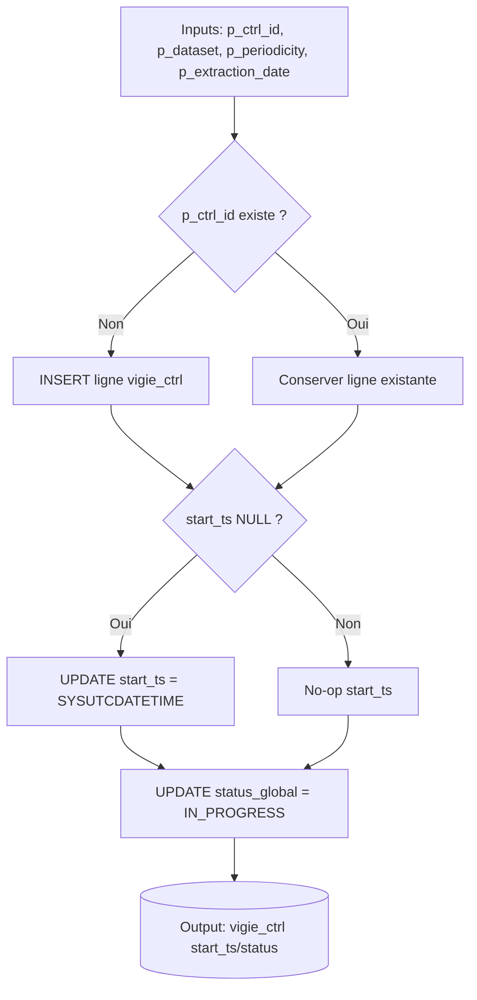
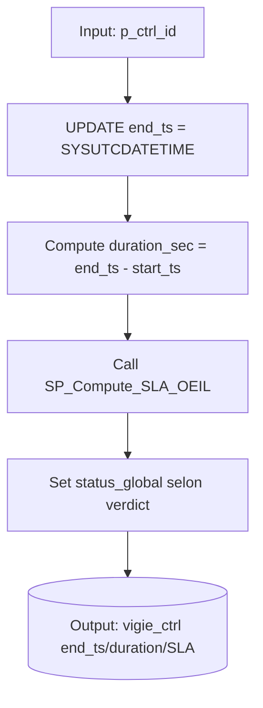
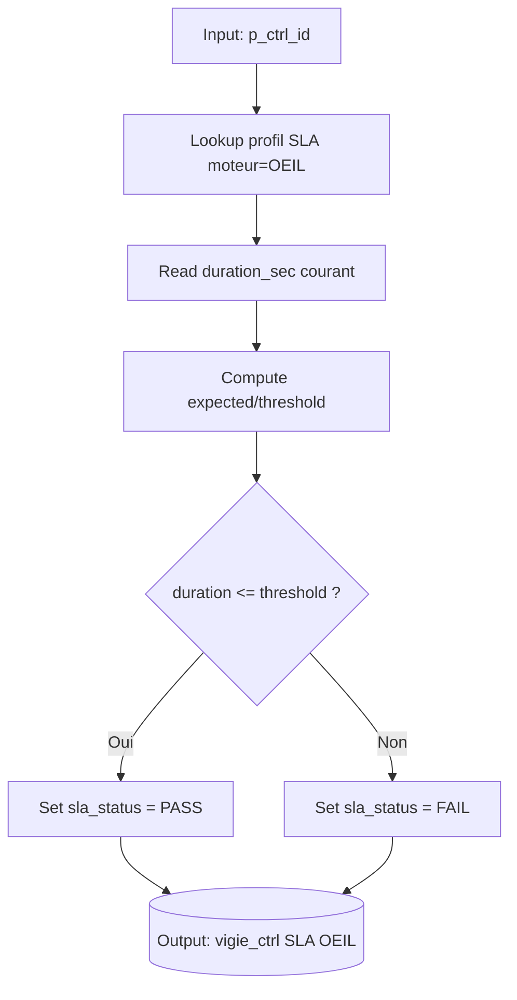
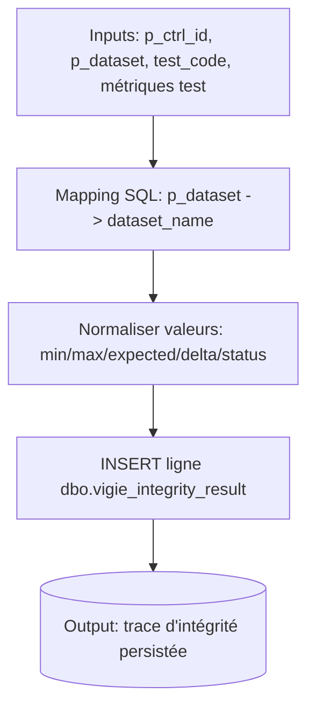
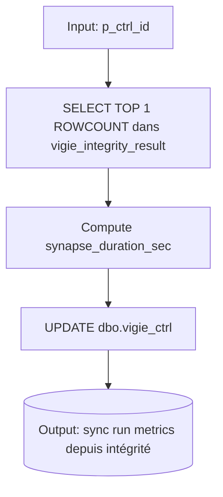

# ⚙️ Stored Procedures

Les procédures stockées Azure SQL sont les points d'intégration pour les calculateurs de SLA et le lifecycle du framework.

## Convention de vocabulaire (cross-docs)

Termes canoniques utilisés dans la documentation : `p_ctrl_id`, `p_dataset`, `p_periodicity`, `p_extraction_date`.

| Canonique (docs) | Paramètre SQL (SP) | Paramètre ADF | Colonne SQL fréquente |
|---|---|---|---|
| `p_ctrl_id` | `@ctrl_id` | `p_ctrl_id` | `ctrl_id` |
| `p_dataset` | `@dataset` | `p_dataset` / `p_table` | `dataset_name` |
| `p_periodicity` | `@periodicity` | `p_periodicity` / `p_period` | `periodicity` |
| `p_extraction_date` | `@extraction_date` | `p_extraction_date` | `extraction_date` |

| Procédure | Rôle | Moteur | Profil SLA | Formule |
|---|---|---|---|---|
| `SP_Set_Start_TS_OEIL` | ⏱️ Lifecycle | — | — | Crée la ligne si elle n'existe pas, pose `start_ts`. Idempotent. |
| `SP_Set_End_TS_OEIL` | ⏱️ Lifecycle | **OEIL** | `EXECUTION_TYPE` | Pose `end_ts`, calcule `duration_sec`, évalue SLA OEIL. |
| `SP_Compute_SLA_ADF` | 📊 Calcul | **ADF** | `EXECUTION_TYPE` | Lit métriques KQL (`row_count`, `duration`), calcule SLA volume-based. |
| `SP_Compute_SLA_SYNAPSE` | 📊 Calcul | **SYNAPSE** | `EXECUTION_TYPE` | Lit durée Synapse, calcule SLA fixed overhead. |
| `SP_Compute_SLA_OEIL` | 📊 Calcul | **OEIL** | `EXECUTION_TYPE` | Appelé en interne par `SP_Set_End`, mais peut être rappelé pour recalcul. |
| `SP_Compute_SLA_Vigie` | 📊 Calcul | **GLOBAL** | `DATASET` (futur) | Calcul SLA global par dataset (plus fin que par moteur). |
| `SP_Update_VigieCtrl_FromIntegrity` | 🔁 Sync qualité → run | **OEIL** | — | Reprend le dernier `ROWCOUNT` de `vigie_integrity_result` et met à jour `vigie_ctrl` (timestamps/durée/status/rowcount). |

## Parameters and Logic

### `SP_Set_Start_TS_OEIL`

```sql
@ctrl_id NVARCHAR(200),
@dataset NVARCHAR(100),
@periodicity NVARCHAR(10),
@extraction_date DATE
```

1.  **INSERT** si `ctrl_id` n'existe pas.
2.  **UPDATE** `start_ts` si NULL.
3.  Set `status_global` = 'IN_PROGRESS'.

### `SP_Set_End_TS_OEIL`

```sql
@ctrl_id NVARCHAR(200)
```

1.  Capture `SYSUTCDATETIME()` → `end_ts`.
2.  Calcule durée totale.
3.  Charge profil SLA (OEIL).
4.  Évalue PASS/FAIL.
5.  Set `status_global` = 'SUCCEEDED' (selon outcome).

### `SP_Compute_SLA_ADF`

```sql
@ctrl_id NVARCHAR(200),
@row_count INT,
@duration_sec INT
```

1.  Charge profil SLA (ADF).
2.  Calcule `expected = overhead + (rows/1000 * cost)`.
3.  Compare `duration` vs `threshold`.
4.  Update `vigie_ctrl` avec verdict.

### `SP_Update_VigieCtrl_FromIntegrity`

```sql
@ctrl_id NVARCHAR(150)
```

1.  Lit la dernière ligne `ROWCOUNT` de `dbo.vigie_integrity_result` pour `@ctrl_id`.
2.  Calcule `synapse_duration_sec = DATEDIFF(SECOND, synapse_start_ts, synapse_end_ts)`.
3.  Met à jour `dbo.vigie_ctrl` avec :
	- `synapse_start_ts`, `synapse_end_ts`, `synapse_duration_sec`
	- `row_count_adf_ingestion_copie_parquet` (depuis `min_value` casté INT)
	- `status` (depuis le `status` d'intégrité)

Règle de réduction (tests multiples) [Implemented]:

- Si plusieurs résultats existent pour un même `ctrl_id` + `ROWCOUNT`, la procédure prend le plus récent.
- Le choix est explicite (`TOP 1 ... ORDER BY integrity_result_id DESC`) pour éviter toute dépendance à l'ordre implicite d'insertion.

## Mini diagrammes (SP critiques)

### 1) `SP_Set_Start_TS_OEIL`



### 2) `SP_Set_End_TS_OEIL`



### 3) `SP_Compute_SLA_OEIL`



### 4) `SP_Insert_VigieIntegrityResult`



### 5) `SP_Update_VigieCtrl_FromIntegrity`



## Pipeline Qualité (Intégrité) — Statut actuel

Le pipeline de qualité est opérationnel avec **2 policies activées** :

- `ROW_COUNT`
- `MIN_MAX`

### Procédures actuellement utilisées

- Azure SQL : `dbo.SP_Insert_VigieIntegrityResult`
- Azure SQL : `dbo.SP_Update_VigieCtrl_FromIntegrity`
- Synapse : `ctrl.SP_OEIL_ROWCOUNT`
- Synapse : `ctrl.SP_OEIL_MIN_MAX`

### Résultats observés (exemple validé)

Exemple sur `ctrl_id = clients_2026-05-01_Q` :

| integrity_result_id | test_code | column_name | min_value | max_value | expected_value | delta_value | status | execution_time_ms |
|---|---|---|---:|---:|---:|---:|---|---:|
| 6 | MIN_MAX | client_id | 101113 | 999862 | 101113 | 0 | PASS | 3 |
| 5 | ROW_COUNT | 'ROWCOUNT' | 872 | 0 | 872 | 0 | PASS | 3 |

Notes :

- Les résultats sont persistés dans `dbo.vigie_integrity_result`.
- Le détail d'orchestration (JSON pipeline + screenshot) sera documenté dans une section dédiée dès intégration des artefacts ADF.
