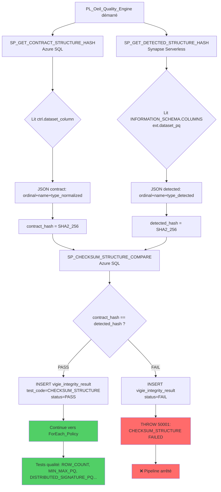
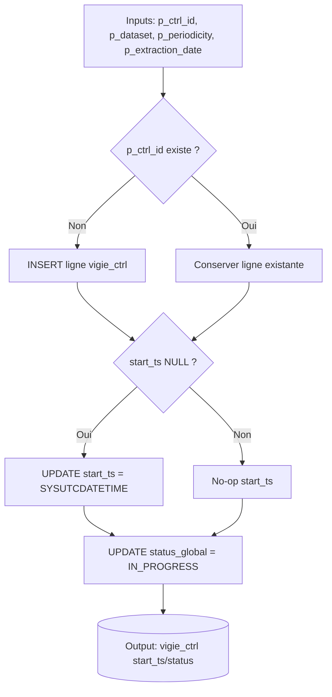
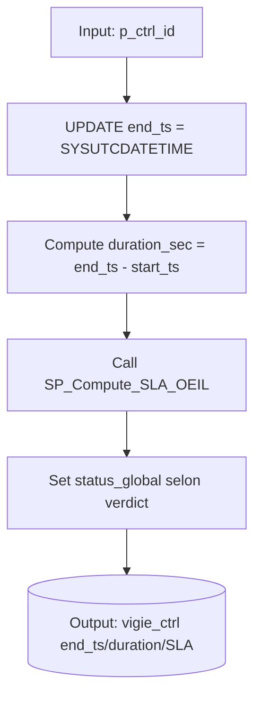
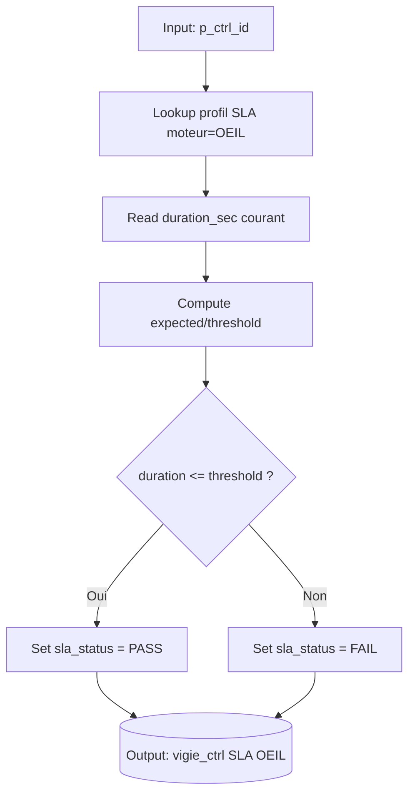
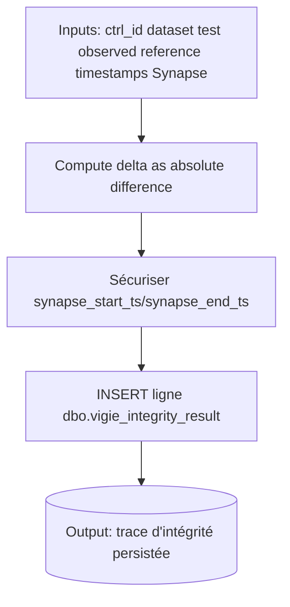
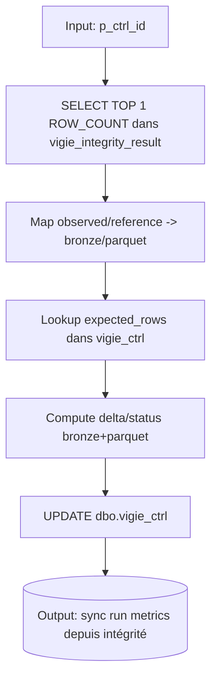

# ⚙️ Stored Procedures

Les procédures stockées sont les points d'intégration pour les calculateurs de SLA, le lifecycle du framework et la validation de qualité.

## 🏛️ Architecture: Azure SQL vs Synapse

**Azure SQL Database** (vigie_ctrl):
- Procédures de **lifecycle** et **orchestration**
- Calculs **SLA** et **quality summary**
- Validation **structurelle** (hash comparison)
- Localisation: `sql/procedures/`

**Synapse Serverless** (pool SQL):
- Procédures d'**inspection** des fichiers Parquet/CSV
- Tests de **qualité** (ROW_COUNT, MIN_MAX_PQ, DISTRIBUTED_SIGNATURE_PQ)
- Détection **structurelle** runtime
- Localisation: `sql/synapse/procedures/`

## Convention de vocabulaire (cross-docs)

Termes canoniques utilisés dans la documentation : `p_ctrl_id`, `p_dataset`, `p_periodicity`, `p_extraction_date`.

| Canonique (docs) | Paramètre SQL (SP) | Paramètre ADF | Colonne SQL fréquente |
|---|---|---|---|
| `p_ctrl_id` | `@ctrl_id` | `p_ctrl_id` | `ctrl_id` |
| `p_dataset` | `@dataset` | `p_dataset` / `p_table` | `dataset_name` |
| `p_periodicity` | `@periodicity` | `p_periodicity` / `p_period` | `periodicity` |
| `p_extraction_date` | `@extraction_date` | `p_extraction_date` | `extraction_date` |

| Procédure | Rôle | Moteur | Profil SLA | Formule |
|---|---|---|---|---|
| `SP_Set_Start_TS_OEIL` | ⏱️ Lifecycle | — | — | Crée la ligne si elle n'existe pas, pose `start_ts`. Idempotent. |
| `SP_Set_End_TS_OEIL` | ⏱️ Lifecycle | **OEIL** | `EXECUTION_TYPE` | Pose `end_ts`, calcule `duration_sec`, évalue SLA OEIL. |
| `SP_Compute_SLA_ADF` | 📊 Calcul | **ADF** | `EXECUTION_TYPE` | Lit métriques KQL (`row_count`, `duration`), calcule SLA volume-based. |
| `SP_Compute_SLA_SYNAPSE` | 📊 Calcul | **SYNAPSE** | `EXECUTION_TYPE` | Lit durée Synapse, calcule SLA fixed overhead. |
| `SP_Compute_SLA_OEIL` | 📊 Calcul | **OEIL** | `EXECUTION_TYPE` | Appelé en interne par `SP_Set_End`, mais peut être rappelé pour recalcul. |
| `SP_Compute_SLA_Vigie` | 📊 Calcul | **GLOBAL** | `DATASET` (futur) | Calcul SLA global par dataset (plus fin que par moteur). |
| `SP_Compute_Quality_Summary` | 📊 Calcul | **QUALITY** | — | Agrège les résultats de `vigie_integrity_result` et met à jour les champs `quality_*` dans `vigie_ctrl`. |
| `SP_Update_VigieCtrl_FromIntegrity` | 🔁 Sync qualité → run | **OEIL** | — | Reprend le dernier `ROW_COUNT` de `vigie_integrity_result`, compare à `expected_rows` et met à jour `vigie_ctrl` (bronze/parquet/timestamps/status). |
| `SP_Verify_Ctrl_Hash_V1` | 🔒 Intégrité CTRL | **OEIL** | — | Vérifie la cohérence du hash canonique CTRL et met à jour `payload_hash_match` dans `vigie_ctrl`. |
| `SP_REFRESH_STRUCTURAL_HASH` | 🔄 Refresh hash | **CTRL** | — | Recalcule le hash structurel SHA-256 basé sur le mapping JSON déterministe des datasets et colonnes. |
| `SP_GET_CONTRACT_STRUCTURE_HASH` (**Azure SQL**) | 🔍 Get contract hash | **CTRL** | — | Génère hash SHA-256 du contrat structurel (ordinal + nom + type normalisé) depuis `ctrl.dataset_column`. |
| `SP_GET_DETECTED_STRUCTURE_HASH` (**Synapse**) | 🔎 Get detected hash | **QUALITY** | — | Génère hash SHA-256 hex (`VARCHAR(64)`) de la structure détectée (ordinal + nom + type réel) depuis `INFORMATION_SCHEMA.COLUMNS` sur la vue dynamique `ext.{dataset_name}_pq`. |
| `SP_CHECKSUM_STRUCTURE_COMPARE` (**Azure SQL**) | ✅ Validate structure | **QUALITY** | — | Compare hash contractuel vs détecté. **THROW 50001** si FAIL, sinon PASS et continue. |

## Parameters and Logic

### `SP_Set_Start_TS_OEIL`

```sql
@ctrl_id NVARCHAR(200),
@dataset NVARCHAR(100),
@periodicity NVARCHAR(10),
@extraction_date DATE
```

1.  **INSERT** si `ctrl_id` n'existe pas.
2.  **UPDATE** `start_ts` si NULL.
3.  Set `status_global` = 'IN_PROGRESS'.

### `SP_Set_End_TS_OEIL`

```sql
@ctrl_id NVARCHAR(200)
```

1.  Capture `SYSUTCDATETIME()` → `end_ts`.
2.  Calcule durée totale.
3.  Charge profil SLA (OEIL).
4.  Évalue PASS/FAIL.
5.  Set `status_global` = 'SUCCEEDED' (selon outcome).

### `SP_Compute_SLA_ADF`

```sql
@ctrl_id NVARCHAR(200),
@row_count INT,
@duration_sec INT
```

1.  Charge profil SLA (ADF).
2.  Calcule `expected = overhead + (rows/1000 * cost)`.
3.  Compare `duration` vs `threshold`.
4.  Update `vigie_ctrl` avec verdict.

### `SP_Insert_VigieIntegrityResult`

```sql
@ctrl_id NVARCHAR(150),
@dataset_name NVARCHAR(150),
@test_code NVARCHAR(50),
@column_name NVARCHAR(150) = NULL,

@bronze_value FLOAT = NULL,
@bronze_aux_value FLOAT = NULL,
@parquet_value FLOAT = NULL,
@parquet_aux_value FLOAT = NULL,

@status NVARCHAR(30),
@execution_time_ms INT = NULL,

@synapse_start_ts DATETIME2 = NULL,
@synapse_end_ts DATETIME2 = NULL,

@observed_value_text NVARCHAR(500) = NULL,
@reference_value_text NVARCHAR(500) = NULL
```

1.  Calcule `delta_value = ABS(@bronze_value - @parquet_value)` quand les 2 valeurs numériques sont présentes.
2.  Sécurise `synapse_start_ts` / `synapse_end_ts` (fallback `SYSUTCDATETIME()` et correction si `end < start`).
3.  Insère la ligne dans `dbo.vigie_integrity_result` avec :
	- valeurs numériques (`observed_value_num`, `reference_value_num`, etc.)
	- valeurs texte (`observed_value_text`, `reference_value_text`) pour les tests non numériques (ex: distributed signature)
	- statut, timing et timestamps.

### `SP_Compute_Quality_Summary`

```sql
@ctrl_id NVARCHAR(150)
```

1.  Agrège les statuts (`PASS`, `FAIL`, `WARNING`) de `dbo.vigie_integrity_result` pour `@ctrl_id`.
2.  Calcule les compteurs qualité :
	- `quality_tests_total`
	- `quality_tests_pass`
	- `quality_tests_fail`
	- `quality_tests_warning`
3.  Détermine `quality_status_global` selon la règle:
	- `UNKNOWN` si aucun test
	- `FAIL` si au moins un fail
	- `WARNING` sinon si au moins un warning
	- `PASS` sinon
4.  Met à jour `dbo.vigie_ctrl` pour le `ctrl_id` ciblé.

### `SP_Update_VigieCtrl_FromIntegrity`

```sql
@ctrl_id NVARCHAR(150)
```

1.  Lit la dernière ligne `ROW_COUNT` de `dbo.vigie_integrity_result` pour `@ctrl_id`.
2.  Calcule `synapse_duration_sec = DATEDIFF(SECOND, synapse_start_ts, synapse_end_ts)`.
3.  Lit `expected_rows` dans `dbo.vigie_ctrl`.
4.  Met à jour `dbo.vigie_ctrl` avec :
	- `bronze_rows` (depuis `observed_value_num`) + `bronze_delta` + `bronze_status`
	- `parquet_rows` (depuis `reference_value_num`) + `parquet_delta` + `parquet_status`
	- `synapse_start_ts`, `synapse_end_ts`, `synapse_duration_sec`
	- `status` (depuis le `status` d'intégrité)

Convention importante :

- Pour le test `ROW_COUNT`, la valeur Bronze est portée par `observed_value_num` et la valeur Parquet par `reference_value_num`.

Règle de réduction (tests multiples) [Implemented]:

- Si plusieurs résultats existent pour un même `ctrl_id` + `ROW_COUNT`, la procédure prend le plus récent.
- Le choix est explicite (`TOP 1 ... ORDER BY integrity_result_id DESC`) pour éviter toute dépendance à l'ordre implicite d'insertion.

### `SP_Verify_Ctrl_Hash_V1`

```sql
@ctrl_id NVARCHAR(200)
```

Logique implémentée (V1):

1. Lit `dataset`, `periodicity`, `extraction_date`, `expected_rows`, `payload_hash_sha256` depuis `dbo.vigie_ctrl`.
2. Reconstruit `payload_canonical` au format exact:
	- `dataset|periodicity|YYYY-MM-DD|expected_rows`
3. Recalcule `@computed_hash` en `SHA2_256` (hex lowercase, sans préfixe `0x`) via:
	- `HASHBYTES('SHA2_256', CAST(@payload_canonical AS VARCHAR(MAX)))`
	- `CONVERT(VARCHAR(64), ..., 2)` puis `LOWER(...)`
4. Compare `LOWER(@stored_hash)` au hash recalculé.
5. Met à jour `dbo.vigie_ctrl` avec:
	- `payload_canonical`
	- `payload_hash_version = 1`
	- `payload_hash_match` (`1` si match, sinon `0`)
	- `alert_flag` (`0` si match, sinon `1`)
	- `alert_reason` = `HASH_OK` / `CTRL_HASH_MISMATCH` / `MISSING_HASH`

Contrat orchestration actuel:

- Si `payload_hash_match = 1`, le run continue vers `PL_Oeil_Core`.
- Si `payload_hash_match = 0`, le run est stoppé (`CTRL_HASH_MISMATCH`).

Exemple canonique V1:

`clients|Q|2026-07-01|1199`

### `SP_REFRESH_STRUCTURAL_HASH`

```sql
@dataset_name VARCHAR(100) = NULL  -- NULL = tous les datasets
```

1. Parcourt tous les datasets actifs (ou uniquement `@dataset_name` si spécifié).
2. Pour chaque dataset, génère un JSON déterministe incluant:
	- `dataset_name`, `source_system`, `mapping_version`
	- Liste ordonnée des colonnes avec leurs propriétés (ordinal, name, types, nullable, keys, tokenization, normalization)
3. Calcule le hash SHA-256 du JSON.
4. Met à jour `ctrl.dataset.structural_hash` avec la valeur calculée.

Utilisé pour détecter les changements de structure/mapping et invalider les runs basés sur une version obsolète du schéma.

### `SP_GET_CONTRACT_STRUCTURE_HASH` (**Azure SQL**)

```sql
@dataset_name VARCHAR(100)
```

1. Lit la structure **contractuelle** depuis `ctrl.dataset` et `ctrl.dataset_column`.
2. Génère un JSON déterministe avec:
	- `ordinal` (ordre des colonnes)
	- `name` (nom de colonne)
	- `type_detected` (type normalisé: `int`, `varchar`, `date`, etc.)
3. Calcule le hash SHA-256 du JSON.
4. Retourne `contract_structure_json` et `contract_structural_hash`.

Normalisation des types pour garantir comparaison:
- `VARCHAR(n)` → `varchar`
- `CHAR(n)` → `char`
- `DECIMAL(p,s)` → `decimal`
- `DATETIME2` / `DATETIME` → `datetime2`

### `SP_GET_DETECTED_STRUCTURE_HASH` (**Synapse Serverless**)

```sql
@dataset_name NVARCHAR(150)
```

1. Cible la vue dynamique `ext.{dataset_name}_pq` (ex: `ext.clients_pq`).
2. Interroge `INFORMATION_SCHEMA.COLUMNS` pour obtenir la structure **réelle** du Parquet.
3. Génère un JSON déterministe avec:
	- `ordinal` (ordre effectif des colonnes)
	- `name` (nom effectif)
	- `type_detected` (type SQL détecté par Synapse)
4. Calcule le hash SHA-256 du JSON et le convertit en hex (`VARCHAR(64)`).
5. Retourne `detected_structure_json` et `detected_structural_hash` (hex).

**Note critique**: Cette SP s'exécute **dans Synapse**, pas dans Azure SQL.

### `SP_CHECKSUM_STRUCTURE_COMPARE` (**Azure SQL**)

```sql
@ctrl_id        NVARCHAR(150),
@dataset_name   NVARCHAR(150),
@contract_hash  VARBINARY(32),
@detected_hash  VARBINARY(32)
```

1. Compare `@contract_hash` (attendu) vs `@detected_hash` (réel).
2. Insère résultat dans `dbo.vigie_integrity_result`:
	- `test_code = 'CHECKSUM_STRUCTURE'`
	- `observed_value_text` = hash détecté (hex)
	- `reference_value_text` = hash contractuel (hex)
	- `status` = `PASS` / `FAIL`
3. **Si FAIL**: `THROW 50001` → bloque le pipeline immédiatement.
4. **Si PASS**: retourne résumé et continue.

**Rôle critique**: Point de contrôle **pré-qualité**. Si la structure ne match pas (ordre colonnes, types, noms), le pipeline s'arrête **avant** les tests ROW_COUNT/MIN_MAX/DISTRIBUTED_SIGNATURE pour éviter erreurs downstream.

## 🔒 Concurrency & Idempotence Guarantees

- La PK (`ctrl_id`) protège contre les doubles insertions de run logique dans `vigie_ctrl`.
- `SP_Set_Start_TS_OEIL` ne réécrit pas `start_ts` si déjà posé.
- `SP_Set_End_TS_OEIL` ne réécrit pas `end_ts` si déjà posé (comportement attendu d'idempotence lifecycle).
- `SP_Update_VigieCtrl_FromIntegrity` applique une réduction `latest` (dernier `ROW_COUNT` via `TOP 1 ... ORDER BY integrity_result_id DESC`).

## Mini diagrammes (SP critiques)

### 0) **Validation Structurelle** (nouveau flux pré-qualité)


```mermaid
flowchart TD
    A[PL_Oeil_Quality_Engine démarré] --> B[SP_GET_CONTRACT_STRUCTURE_HASH<br/>Azure SQL]
    B --> C{Lit ctrl.dataset_column}
    C --> D[JSON contract: ordinal+name+type_normalized]
    D --> E[contract_hash = SHA2_256]
    
    A --> F[SP_GET_DETECTED_STRUCTURE_HASH<br/>Synapse Serverless]
	F --> G{Lit INFORMATION_SCHEMA.COLUMNS<br/>ext.dataset_pq}
    G --> H[JSON detected: ordinal+name+type_detected]
    H --> I[detected_hash = SHA2_256]
    
    E --> J[SP_CHECKSUM_STRUCTURE_COMPARE<br/>Azure SQL]
    I --> J
    
    J --> K{contract_hash == detected_hash ?}
    K -->|PASS| L[INSERT vigie_integrity_result<br/>test_code=CHECKSUM_STRUCTURE<br/>status=PASS]
    L --> M[Continue vers ForEach_Policy]
	M --> N[Tests qualité: ROW_COUNT, MIN_MAX_PQ, DISTRIBUTED_SIGNATURE_PQ...]
    
    K -->|FAIL| O[INSERT vigie_integrity_result<br/>status=FAIL]
    O --> P[THROW 50001:<br/>CHECKSUM_STRUCTURE FAILED]
    P --> Q[❌ Pipeline arrêté]
    
    style P fill:#ff6b6b
    style Q fill:#ff6b6b
    style M fill:#51cf66
    style N fill:#51cf66
```

**Impact**: Cette validation structurelle **bloque** le pipeline si:
- Ordre des colonnes différent
- Types SQL incompatibles (ex: `int` vs `varchar`)
- Colonnes manquantes ou ajoutées

Cela évite les erreurs downstream et garantit la conformité au contrat avant d'exécuter les tests coûteux.

### 1) `SP_Set_Start_TS_OEIL`


```mermaid
flowchart TD
	A[Inputs: p_ctrl_id, p_dataset, p_periodicity, p_extraction_date] --> B{p_ctrl_id existe ?}
	B -->|Non| C[INSERT ligne vigie_ctrl]
	B -->|Oui| D[Conserver ligne existante]
	C --> E{start_ts NULL ?}
	D --> E
	E -->|Oui| F[UPDATE start_ts = SYSUTCDATETIME]
	E -->|Non| G[No-op start_ts]
	F --> H[UPDATE status_global = IN_PROGRESS]
	G --> H
	H --> I[(Output: vigie_ctrl start_ts/status)]
```

### 2) `SP_Set_End_TS_OEIL`


```mermaid
flowchart TD
	A[Input: p_ctrl_id] --> B[UPDATE end_ts = SYSUTCDATETIME]
	B --> C[Compute duration_sec = end_ts - start_ts]
	C --> D[Call SP_Compute_SLA_OEIL]
	D --> E[Set status_global selon verdict]
	E --> F[(Output: vigie_ctrl end_ts/duration/SLA)]
```

### 3) `SP_Compute_SLA_OEIL`


```mermaid
flowchart TD
	A[Input: p_ctrl_id] --> B[Lookup profil SLA moteur=OEIL]
	B --> C[Read duration_sec courant]
	C --> D[Compute expected/threshold]
	D --> E{duration <= threshold ?}
	E -->|Oui| F[Set sla_status = PASS]
	E -->|Non| G[Set sla_status = FAIL]
	F --> H[(Output: vigie_ctrl SLA OEIL)]
	G --> H
```

### 4) `SP_Insert_VigieIntegrityResult`


```mermaid
flowchart TD
	A[Inputs: ctrl_id dataset test observed reference timestamps Synapse] --> B[Compute delta as absolute difference]
	B --> C[Sécuriser synapse_start_ts/synapse_end_ts]
	C --> D[INSERT ligne dbo.vigie_integrity_result]
	D --> E[(Output: trace d'intégrité persistée)]
```

### 5) `SP_Update_VigieCtrl_FromIntegrity`


```mermaid
flowchart TD
	A[Input: p_ctrl_id] --> B[SELECT TOP 1 ROW_COUNT dans vigie_integrity_result]
	B --> C[Map observed/reference -> bronze/parquet]
	C --> D[Lookup expected_rows dans vigie_ctrl]
	D --> E[Compute delta/status bronze+parquet]
	E --> F[UPDATE dbo.vigie_ctrl]
	F --> G[(Output: sync run metrics depuis intégrité)]
```

## Pipeline Qualité (Intégrité) — Statut actuel

Le pipeline de qualité est opérationnel avec **2 policies activées** :

- `ROW_COUNT`
- `MIN_MAX`

### Procédures actuellement utilisées

- Azure SQL : `dbo.SP_Insert_VigieIntegrityResult`
- Azure SQL : `dbo.SP_Update_VigieCtrl_FromIntegrity`
- Synapse : `ctrl.SP_OEIL_ROWCOUNT`
- Synapse : `ctrl.SP_OEIL_MIN_MAX_PQ`
- Synapse : `ctrl.SP_OEIL_DISTRIBUTED_SIGNATURE_PQ`

### Procédure Synapse ajoutée (distributed signature)

`ctrl.SP_OEIL_DISTRIBUTED_SIGNATURE_PQ` calcule une signature distribuée (COUNT, MIN, MAX, SUM, SUM(CHECKSUM), SUM(BINARY_CHECKSUM)) puis compare son hash SHA-256 à la signature attendue.

Signature:

```sql
ctrl.SP_OEIL_DISTRIBUTED_SIGNATURE_PQ(
	@dataset_name NVARCHAR(100),
	@column_name NVARCHAR(128),
	@expected_signature NVARCHAR(64),
	@year NVARCHAR(4),
	@month NVARCHAR(2),
	@day NVARCHAR(2)
)
```

Sortie:

- `signature_input_string`
- `parquet_signature`
- `contract_signature`
- `integrity_status` (`PASS` / `FAIL`)

### Résultats observés (exemple validé)

Exemple sur `ctrl_id = clients_2026-05-01_Q` :

| integrity_result_id | test_code | column_name | observed_value_num | observed_value_aux_num | reference_value_num | reference_value_aux_num | delta_value | status | execution_time_ms | synapse_start_ts | synapse_end_ts |
|---|---|---|---:|---:|---:|---:|---:|---|---:|---|---|
| 6 | MIN_MAX | client_id | 101113 | 999862 | 101113 | 999862 | 0 | PASS | 3 | 2026-02-19 13:29:21 | 2026-02-19 13:29:50 |
| 5 | ROW_COUNT | ROW_COUNT | 872 | 0 | 872 | 0 | 0 | PASS | 3 | 2026-02-19 13:29:21 | 2026-02-19 13:29:50 |

Notes :

- Les résultats sont persistés dans `dbo.vigie_integrity_result` via la nouvelle structure `observed/reference`.
- Les tests textuels (ex: `DISTRIBUTED_SIGNATURE`) renseignent `observed_value_text` et `reference_value_text`.
- Si `synapse_start_ts` ou `synapse_end_ts` est absent, la SP les initialise à `SYSUTCDATETIME()`.
- Le détail d'orchestration (JSON pipeline + screenshot) sera documenté dans une section dédiée dès intégration des artefacts ADF.

